# Stardew Valley Themed Memory Game

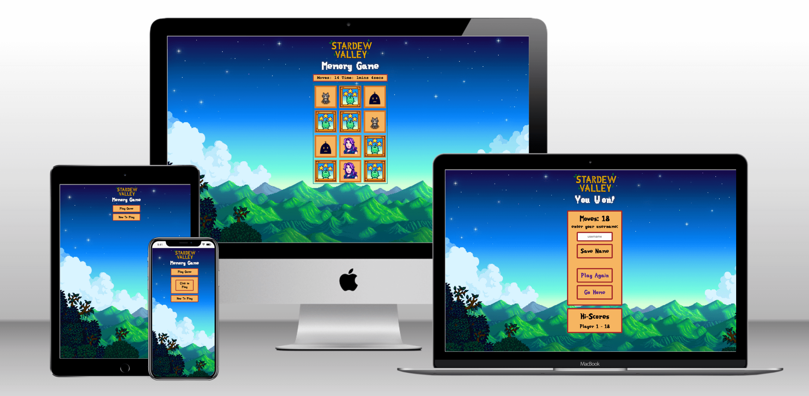

#### **By Zoe Heathcote**
[Click here to view the live web application](https://zog08.github.io/memory-game-MP2/)

This is the documentation for my web application: Stardew Valley Themed Memory Game. It has been built using HTML5, CSS3 & JavaScript for educational purposes as part of Code Institute’s Diploma in Web Application Development Course.

- - -
## Table of Contents

1. [Project Development & Planning](#project-development--planning)
    * [Project Goals](#project-goals)
    * [Research](#research)
    * [User Stories](#user-stories)
    * [Content](#content)
    * [Design, Layout & Structure](#design-layout--structure)
2. [Technologies Used](#technologies-used)
3. [Features](#features)
4. [JavaScript Functionality](#javascript-functionality)
5. [Testing & Bugs](#testing--bugs)
6. [Deployment](#deployment)
7. [Credits](#credits)

- - -
## Project Development & Planning
Throughout the development of this game I followed the principles of User Experience (UX), including the 5 planes of Strategy, Scope, Structure, Skeleton & Surface. At all times I wanted to make sure that the website was easy to use, responsive, accessible and intuitive as well as meeting the goals and needs of the user and client.
- - -
### Project Goals

#### **Project Purpose**
A web-based game that tests the users memory and invokes a theme of the popular existing game, Stardew Valley.

#### **Client Goals**
The quiz was built as the second milestone project for my Diploma in Web Application Development with [Code Institute](https://codeinstitute.net/) as a learning tool for interactive frontend development and my first project using JavaScript and so didn't have a specific client.
However in order to make the end product more professional and to help with create a clear scope for the project I treated it as a real-world application which could be used by a person wishing to play a game or as a fan of Stardew Valley. This client's goals would be:

* Engaging users with a fun game to test their memory
* Engaging users who are fans of Stardew Valley 
* Engaging users who have not yet heard of Stardew Valley and give them a taste of its themes and artwork, and maybe get them hooked.
* Passing time or giving the client extra activities for their site in the theme of gaming or Stardew valley

#### **User Goals**
The audience for this game would be people of any age who has either an interest in testing their memory in a fun way, or users who are or would like to become a fan of Stardew Valley. The game does not depend on any prior knowledge of Stardew Valley though, so anyone could use it.
User Goals:
* To test their own memory skills and try to improve their score
* Have some fun playing a game
* Ability to engage where little or no prior Stardew Valley knowledge is required to play
* To learn more about the artwork and characters from Stardew Valley and pique their interest.

- - -
### Research

#### **Market Review**
I looked at a variety of online memory games, some from past Code Institute students and some found elsewhere on the internet. You can see some of the pages researched below:

[Helpful Games Memory Game](https://www.helpfulgames.com/subjects/brain-training/memory.html) | [Improve Memory Card Game](https://www.improvememory.org/brain-games/memory-games/magic-cards/) | [Nintendo Characters Merry Matches Game](https://play.nintendo.com/activities/memory-match/holiday-merry-memory-match-game/) | [Disney Characters Wordwall Memory Game](https://wordwall.net/resource/3421059/princess-memory-game) | [Musical Instrument Memory Game](https://insidetheorchestra.org/outside-the-orchestra/musical-memory/) 

#### **Key Takeaways from Market Review**
* Where I am only providing a single level of difficulty, it helps to play against a clock to imrove yourself
* It was less enjoyable when the cards were not easily discernable from each other
* Some quizzes used noises, music, and animations which did not improve the game but did add fun to the experience
* Some quizzes were slow to turn the cards and this affected my enjoyability
* Some websites were far too busy, with adverts and unusual placements taking away from the ability to play the game

- - -
### User Stories
Based on the research and goal development above I created a list of user stories. I felt that the game was most likely to be something that a visitor came across once and perhaps played a few times in a row, rather than repeatedly, as it would likely form part of a bigger website e.g. a Stardew Valley or gaming fan site, with a user moving on to discover more about the products offered, so all user stories relate to a first time user.

#### **User**
1. I want to take part in a fun, online game
2. I want to test my memory skills
3. I want to improve my memory skills / brainpower / speed
4. I want to enjoy the Stardew Valley theme
5. I want to access the quiz on any device
6. I want to navigate the site easily

#### **Client**
7. I want to entertain visitors to my site and keep them there for longer periods of time
8. I want to educate the user on Stardew Valley Characters and artwork
9. I want the user to enjoy visiting my site
10. I want to capture new audiences and translate them into regular visitors
11. I want the site to work correctly and efficiently

- - -
### Content
The game is made up of 6 pairs of character cards made popular by the original game Stardew Valley. 
These characters are:
* Emily
* Abigail
* Caroline
* Krobus
* Cat
* Dog 

The artwork in the background, fonts and images are all taken from the official Stardew Valley game to show a cohesive branding.

#### **Overview of page content
* When the game is started, the cards are shuffled face down.
* The user clicks pairs of cards to find a matching pair.
* If a matching pair is found the cards remain turned, if there is no match the cards are returned to face down.
* There is a timer that starts when the user makes their first card choice.
* You win the game by finding all the matches.
* The amount of moves (cards turned over) is stored and if the users score is in the top five fewest moves, their name is added to the High Scores list.

- - -
### Design, Layout & Structure

#### **Wireframes**
I decided to create a fully designed site in Balsamiq, developing the structure, skeleton and layout as well as the style and look of the site, making all major creative design decisions, including the colours, fonts & layout prior to beginning coding. I created a site that was very similar over mobile, tablet and desktop and made sure that responsiveness was at the forefront of the application from the beginning.

<details><summary>Start Page</summary>
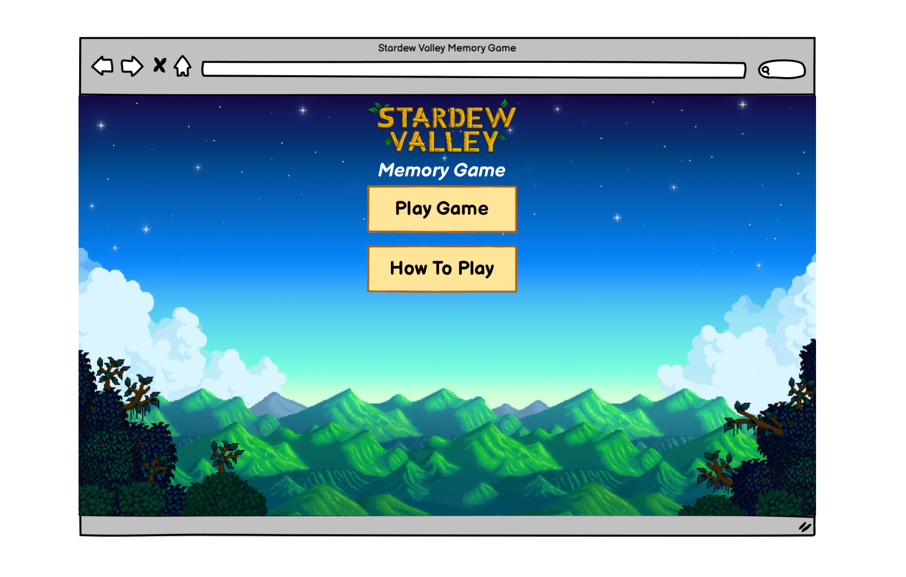
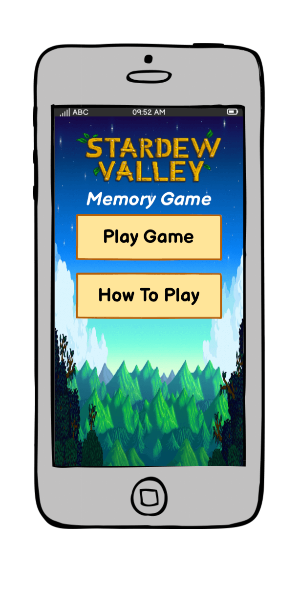
</details>

<details><summary>Start Page, How To Play</summary>
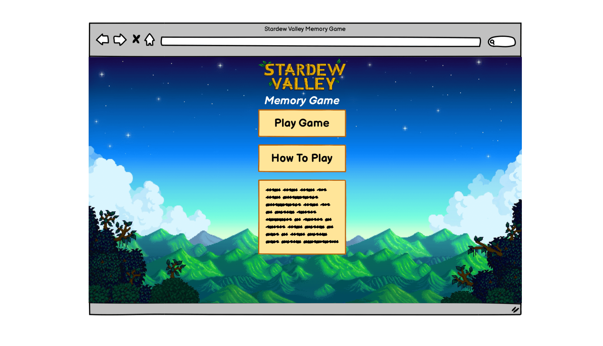
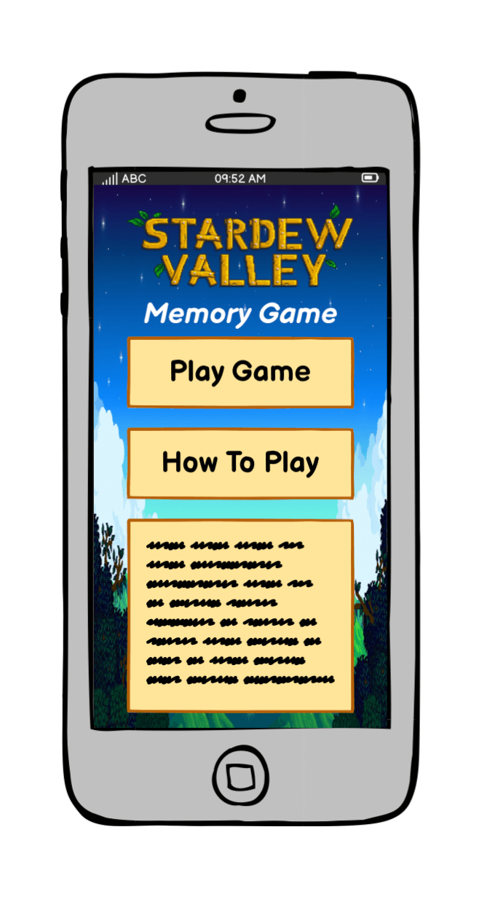
</details>

<details><summary>Start Page, Click To Play</summary>
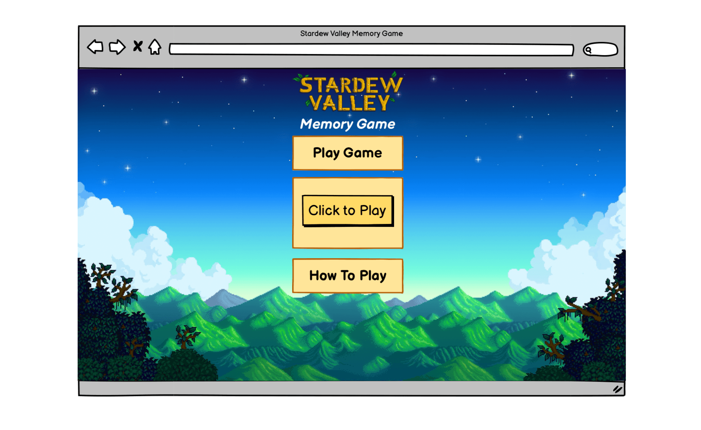
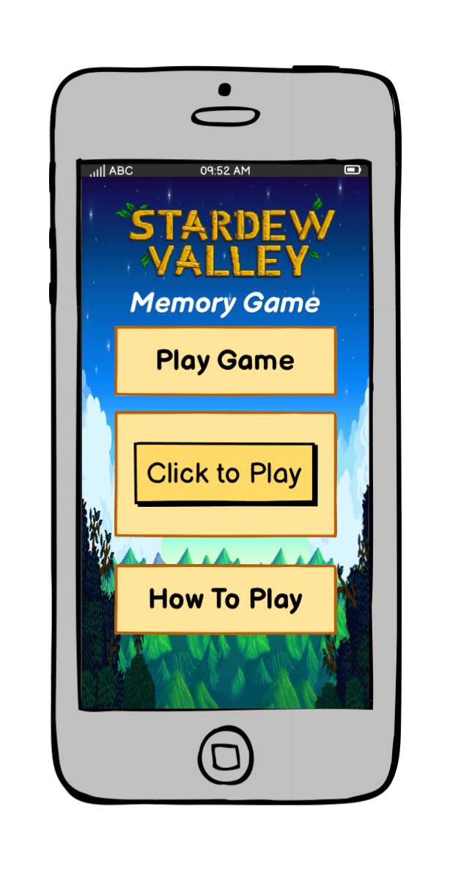
</details>

<details><summary>Game Page</summary>
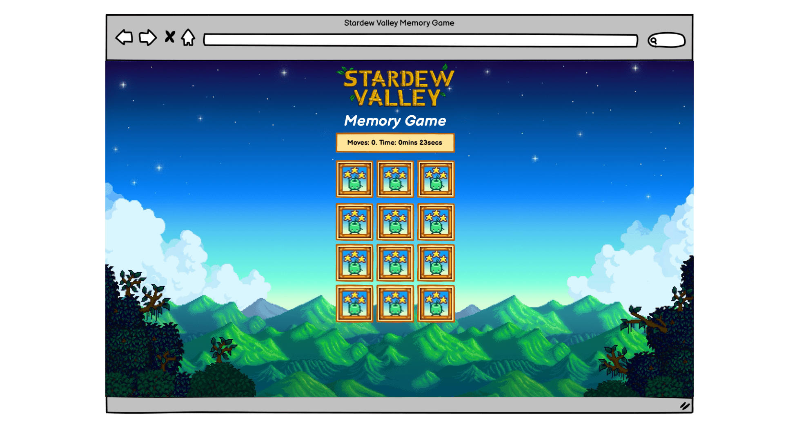
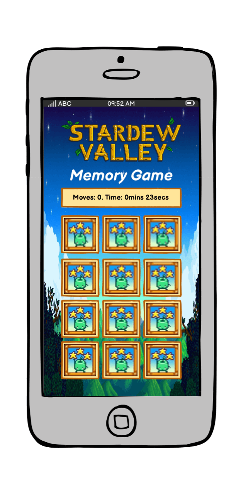
</details>

<details><summary>End Page</summary>
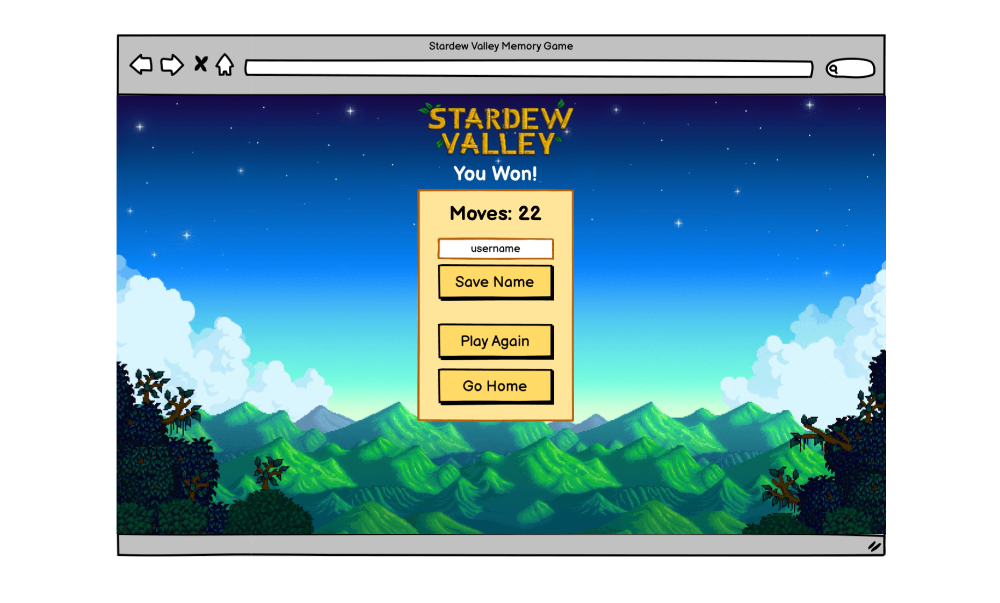
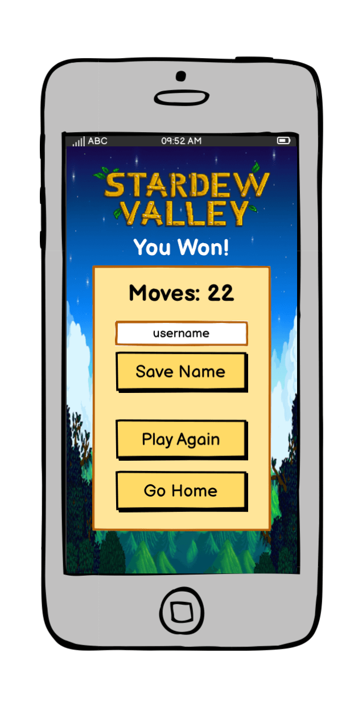
</details>

<details><summary>404 Page</summary>
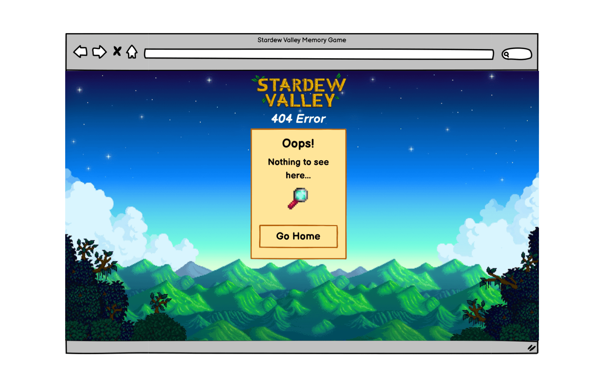
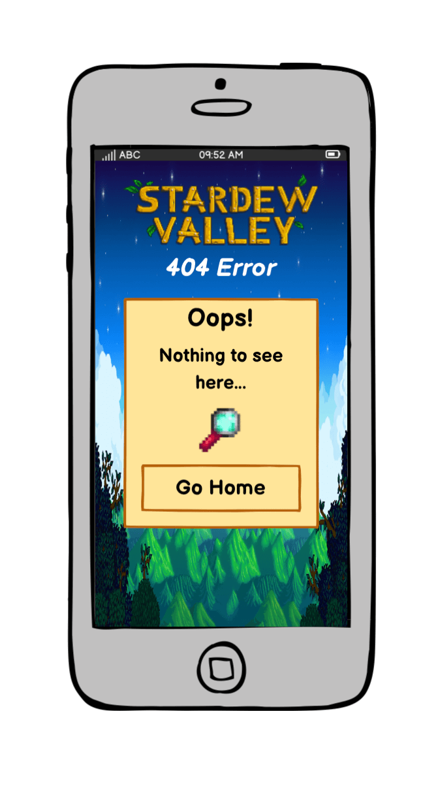
</details>
   
- - -
#### **Structure**

The structure of the site is informed by the scope, user and business goals as well as the principles of IXD (interaction design) to make sure I was conforming to users' expectations and making everything as intuitive as I could.

The site has a simple structure, there are in total, 3 pages plus the 404 page. The game is contained on one page. The HTML is kep to a minimum where possible, and javascript introduces this via functions as the game is played.

* Start Page - a brief intro with a drop down menu to read the rules of the game, and a button to click to play the game.
* Game Page - the main game play area, with a moves counter and timer, and an option to click back to the start screen via the main logo
* End Page - the results of the game, with total moves shown and a form with input to save your name to a hi-score list. There is also buttons to direct straight back to the game to play again, or a button to go back to the main start page.

There is also a 404 page for when a user lands on a non-existent page with a button to link back to index.html to start the game again

All pages have a clickable logo header at the top of the screen to redirect back to the start page for consistency.

- - -
#### **Colour & Design**

The design of the site is influenced by the original Stardew Valley game (https://www.stardewvalley.net/), using elements of the original game design such as the background photo, fonts and images of the characters. I have therefore used shades that match the original design and branding of Stardew Valley. I have ensured that the fonts chosen are compatible with accessibility in terms of size, colours and legibility.
I colour picked using coolors.co using a Stardew Valley theme screenshot, then altered these codes to find a final, well contrasted, colour palette considering the by nature very busy design of the graphics.

<details><summary>Initial Colour Picker from Screenshot</summary>
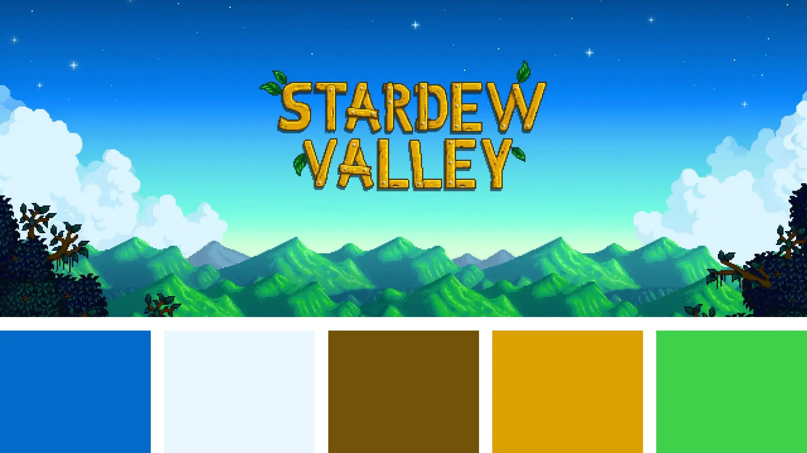
</details>

<details><summary>Initial Colour Palette</summary>

</details>

<details><summary>Adjusted Final Colour Palette</summary>
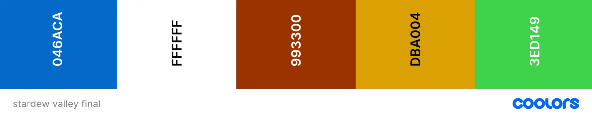
</details>


- - -
**Other Design Choices**
* The use of shadows on boxes and fonts to ensure legibility and to make them pop in the very 2d nature of the design.
* Consistent use of border on boxes, input, cards in brown to lift the elements from the busy background while keeping in theme
* The use of a themed cursor, a 'Junimo' that looks like a little apple character when hovering over the cards on desktop

- - -
#### **Fonts**

I downloaded the specialty font as a .woff file straight into the documents. The font from Stardew Valley was not available on Google Fonts or similar, therefore this was the only way it could be done. It was found on reddit made by user @cowsplay and downloaded from [their dropbox](https://www.dropbox.com/scl/fo/yj7f693fastcxousb4a77/ALOsUplSqL1DSpqk6iJ9sK0?rlkey=jt2mobz467ah9vhcyf404244e&e=1&st=zss04ys1&dl=0)
I had a fallback font of sans-serif standard font as I felt this was a good match with the 8-bit simplified nature of the design. 

- - -
>>>>>>>>>>>>>>>>>>>>>>>> DONE TO HERE!!!!!!!>>>>>>>>>>>>>>>>>>>>>>
## Technologies Used

### Languages
* [HTML](https://en.wikipedia.org/wiki/HTML5)
* [CSS](https://en.wikipedia.org/wiki/Cascading_Style_Sheets)
* [JavaScript](https://en.wikipedia.org/wiki/JavaScript)

- - -
### Tools

* [Git](https://git-scm.com/)
    * Used for version control via GitPod by using the terminal to Git and Push to GitHub
* [GitHub](https://github.com/)
    * Used to store the project code after being created in GitPod / Git
* [Gitpod](https://www.gitpod.io/)
    * Used to create, edit & preview the project's code
* [Figma](https://www.figma.com/)
    * Used to develop the wireframes in to a full mockup including colours, fonts, proportions etc
* [Google Fonts](https://fonts.google.com/)
    * Used to select & import the fonts to the project (Poppins & Fira Sans)
* [Font Awesome](https://fontawesome.com/)
    * Used to add icons to the site
* [Adobe Illustrator](https://www.adobe.com/uk/products/illustrator.html)
    * Used to help create the colour pallette as well as adjusting the background image
* [Adobe Photoshop](https://www.adobe.com/uk/products/photoshop.html)
    * Used to crop, adjust and resize the photos to optimise them for the site
* [Tiny PNG](https://tinypng.com/)
    * Used to further optimise the images for the site and reduce file size
* [Bulk Image Crop](https://bulkimagecrop.com/)
    * Used to bulk crop bulk
* [ezGIF](https://ezgif.com/)
    * Creating GIFs for the README
* [Techsini Mockup](https://techsini.com/multi-mockup/)
    * Creating the mockup images for the README
* [Favicon.io](https://favicon.io/favicon-converter/)
    * Used to create and add the favicon to the browser tab
* [Chart.js](https://www.chartjs.org/)
    * Used to create and style the pie chart based on user personality results
* [Google Maps API](https://developers.google.com/maps)
    * Linked to Google Maps API to load the relevant country map and create clickable markers

- - -
## Features

### All Sections/Pages

#### **Favicon**

<details><summary>Screenshots</summary>


*Favicon*

</details>

* I included a Favicon for the site using the little plane graphic from the logo. This helped to build the brand and continue the site design in the user's browser tab.

#### **Logo**

<details><summary>Screenshots</summary>


*Logo*

</details>

* A simple logo with the name of the game
* The logo appears on all pages
* The logo is responsive and changes sized based on the user's screen size
* The logo isn't clickable. I had originally made it go back to the home page but during testing and based on feedback from my mentor I discovered this could cause a user to accidentally reset the quiz back to the start. This would cause a negative emotional response from a user so I broke the convention of having the logo link to the home page in this case as I felt it provided the best user experience.


#### **Footer**

<details><summary>Screenshots</summary>


*Footer on desktop / tablet*


*Footer on mobile*

</details>

* The footer is made of a series of layered 'paper-like' clouds to give a feeling of being above the clouds in a plane.
* The footer contains the text "Made By Emma Hewson" and links to my relevant social media sites so that it can be used as a portfolio project
* The footer social icons have aria labels to make them accessible
* The footer social icons have a hover effect with a smooth colour transition
* The footer is responsive, the cloud image adjusts as a background image down to tablet-size screens and is replaced by a smaller image on mobile to make the design work and the site perform well.

- - -
### Welcome Section


<details><summary>Screenshots</summary>


*Welcome section*


*Welcome section - start quiz button*


*Hover effect on button*

</details>

* Brief text info about the game, how it works & encouraging the user to play
* Layout is responsive with margins changing on smaller devices
* Name input box
    * User must enter a name to start game - alert with appears if no name entered
    * Name is used in the results section to personalise the results
    * Has a character max of 10 and min of 2 to make the text in the results section work visually
* Start Quiz button - launches the quiz
    * Has a hover effect on non touchscreen devices with a smooth colour transition

- - -
### Game Section


<details><summary>Screenshot</summary>


*Game Section*

</details>

* The game section is fully responsive with the answers stacking full width on smaller devices and in 2 columns on larger devices as well as other layout changes


#### **Progress Bar**

<details><summary>Screenshots</summary>


*Progress Bar updates with each question answered*

</details>

* Gives the user an indication of where they are in the quiz and how many questions are left
* Contains both a visual reference in the pink bar and a number reference in the question number
* Updates when a user selects an answer and the question is repopulated


#### **Questions & Answers**

<details><summary>Screenshots</summary>


*Answer selection & question/answer update*


*Answer hover effect*


</details>

* Updates with the next question and a set of answers each time the user makes a selection
* Has a darker blue hover effect on the answers on non touchscreen devices with a smooth transition
* Once the user has selected an answer it turns orange
* There is a brief timeout to allow the orange to appear before the question & answers update, this gives the user a sense that the answer has definitely been selected and submitted and gives them time to see the question update happenning - all part of creating an intuitive and positive user experience.
* This also avoids having a separate 'next question' button which would add more clicks and may annoy a user
* During the time out the user cannot select another answer - this avoids accidental selections or duplicate results


#### **Restart Quiz Button**

<details><summary>Screenshots</summary>


*Restart Quiz Button*

</details>

* A button to allow the user to go back to the start of the quiz
* Has a hover effect with a short, smooth colour transition on non touchscreen devices
* I chose to make this button grey, rather than orange like the other navigation buttons because I didn't want it to draw the user's attention away from the game too much, it doesn't form part of the game and I didn't want the user to mistakenly click on it thinking it was a 'submit answer' button or similar.

- - -
### Tie Breaker


<details><summary>Screenshots</summary>


*Tie Breaker*


*Tie Breaker - Number of photos varies depending on how many personality-type scores are tied*


*Tie Break Image Hover*

</details>

As there are only 10 questions and each ones selects one of 6 personality types, there was a high chance of a tied result. I wanted to find a way to make the results as accurate and personalised as possible, so, where a tie happens, this round puts the final result decision in to the hands of the user, using images to find out what their perfect trip would look like. This helps it stand apart from the other questions and highlights its importance to the user.

* Images appear which relate to the tied winning personality results, each image representing a personality e.g. "foodie", "culture-vulture" etc.
* User selects one of them, this becomes the winning personality
* This round only appears if there is a tied result
* This round is also taken in to account in the final personality statistics
* There can be anything from 2-5 images depending on how many results were tied
* The images have associated "alt" values to make them accessible
* The layout is fully responsive depending on the screen size and the number of images that appear

- - -
### Results Section


#### **Personality Type**

<details><summary>Screenshots</summary>


*Personality Type Box*


*Clickable pie chart*


*Content of paragraph 3 varies depending on results - this one shows a different example to to other screen shots, where both the 2nd and 3rd place have scored over 15%*


</details>

* This section gives detailed information about the user's personality results
* It is personalised to the user with their name
* The pie chart has a colour key with each personality type having an associated colour
* Each answer selected by the user is associated with one of the personality types, the percentages are calculated based on these, including the tie break
* The pie chart animates on and has clickable sections to see the percentages for each
    * If the pie chart fails to load the user is presented with a friendly error message in the place of the pie chart to improve user experience - see bugs in [TESTING.md](TESTING.md)
* Includes text information about the personality type
* The final paragraph is bespoke to the user's results, if they have high % scores in the 2nd and 3rd place personalities these are included here.
    * The recommended country is based on all the personality types chosen, not just the winning one - this helps explain this to the user.
    * This gives a sense of results being truly personalised to the user
* The personality results are fully responsive, stacking on smaller screens


#### **Recommended Country**

<details><summary>Screenshots</summary>


*Country Recommendation*


</details>

The recommended country is calculated using all the answers given by the user. This adds more accuracy to the results, taking in to account various different aspects of their personality, rather than just associating a single country with a personality type.

It is calculated as follows:
* Each answer relates to a personality type
* Each time the user selects an answer, points are awarded to 3 countries, based on how relevant the personality type is to the destination
    * e.g. if the 'food' answer is selected Mexico gets 3 points, New Zealand gets 2 and Peru gets 1
* These are added up at the end and a winning country is selected

The country recommendation section contains
* The name of the country selected
* A hero image of the country (including an "alt" value to make this accessible)
* Text about the country


#### **Country Highlights**

<details><summary>Screenshots</summary>


*Country Highlights Section*


*Clickable marker with page scroll*


*Google Maps Built in Functionality*


*Responsive map zoom*


</details>

* A map which shows the recommended country using Google Maps API with clickable markers to find out more information about key highlights in that destination
* The highlight information is hidden until the user clicks on a marker
* Each marker is located at the site of a tourist attraction
* Each time a user clicks on a marker it replaces the information, this keeps the page short and neat and creates a better user experience as well as adding interactivity
* There is explanatory text at the top telling the user to click on a marker, though the markers in themselves encourage users to click on them due to the popularity of Google Maps and people's knowledge of it
* When a marker is clicked text and images appear about that destination highlight
* The highlight images have associated "alt" values to make them accessible
* The page scrolls down when a marker is clicked, this varies depending on screen size - on a large device it scrolls to the bottom of the highlights div, this makes sure that the user can see the whole highlight text and photos on screen at the same time, on a smaller device, where this isn't possible, it scrolls to the top of the highlight text.
* This section is fully responsive, as well as layout changes to the main div and photos the map zoom level also changes for different devices to allow the whole country to appear on the user's screen and all markers to be visible and not too close together.
* If something goes wrong and the map fails to load Google has a built in error message to handle the problem in a user-friendly way
* The map also has Google's in-built functionality including:
    * Zoom buttons
    * Touchscreen zoom and scroll
    * Satellite and map view options
    * Streetview
    * Full screen button


#### **Start Again Button**

<details><summary>Screenshots</summary>


*Start Again Button*

</details>

* A button to allow users to re-take the quiz
* Allows users to navigate the site easily and start again if they're not happy with their results
* Has explanatory text to give the site a friendly 'voice'
* Button has a hover effect with a short, smooth colour transition on non touchscreen devices

- - -
### 404 Page


<details><summary>Screenshots</summary>


*404 Page*


*Go Home Button*

</details>

* 404 page to smoothly handle user's who have ended up on a non-existent part of the site
* This bespoke 404 page provides a positive emotional response to the user and a better user experience
* The page has the same design as the rest of the site, so the users don't feel like they have left the site, encouraging them to return to the home page
* The text is light hearted and relevant to the theme of the quiz
* There is a button to take the user back to the home page so there is no need to user the browser back button

- - -
### Future Features
I would like to expand the site in the future with the following features

#### **User Account**
Give the user the ability to save their results and recommendations, creating an account and log in so that they can re-access their data.

#### **Multiple / More Detailed Recommendations**
Give the user more detailed country recommendations, with multiple options and more countries available. This would be a good way to address the bug that I have talked about in the [TESTING document](#TESTING.md) where, when 2 countries have an equal number of points, the country that occurs first in the countries array is automatically selected. It would be a nice idea in this situation to give the user multiple options to choose between or compare.

- - -
## JavaScript Functionality

This section explains in plain English what happens in the JavaScript code as the user moves through the game. This is in addition to the comments in the JavaScript Code.

### Welcome Section

<details><summary>Details</summary>

* The user enters their name and clicks on 'Start Quiz':
    * If no name is entered an alert appears prompting the user to enter a name
    * The name is stored to be used in the results page
    
* The start game button starts the main JavaScript function which contains all the game functionality
</details>

### Game Section

<details><summary>Details</summary>

* The start game button:
    * hides the welcome section and reveals the game section
    * populates the question & answers from the first question in the questions array (in a separate .js file)
    ```
    const questions = [{
        questionNumber: 1,
        questionText: "At a party you are most likely to be found…",
        answers: [{
                answerNumber: 1,
                answerText: "Leafing through the host's book collection",
                answerType: "culture"
            },
            {
                answerNumber: 2,
                answerText: "Jumping off the roof in to the pool",
                answerType: "thrill"
            },

    // questions array continues
    ```
    * sets the progress bar based on the question number of the first question in the questions array


* When the user selects an answer:
    * All other answers are disabled so the user cannot select more than once
    * The answer is given a class of 'selected' to change its colour
    * Each answer has an associated 'personality type' - this is logged to an array called 'personality tally', for each answer selected another 'personality type' is added to the array, one for each question.
    ```
    // user selects "thrill-seeker" answer

    personalityTally = ["thrill"]
    ```
    * There is a brief timeout before the question reloads (see [Answers](#answers) in features section for more information)
    * The 'selected' class is removed from the selected answer to remove the colour styling
    * The first question in the questions array is removed from the array
    * The game is populated with the question and answers from the new first question in the questions array
    * The buttons are re-enabled
    * The progress bar is moved on based on the question number of the first question in the questions array
    * The page scrolls back to the top
    * This repeats until there are no questions left in the questions array

* When the user selects the final answer:
    * Calculating the winning personality:
        * The personality tally contains the 10 personality types that come from the selected answers
        ``` 
        personalityTally = ["thrill", "food", "culture", "thrill", "thrill", "people", "remote", "food", "food", "culture"]
        ```
        * The code checks for the type that occurs the most frequently
            * It does this by: 
                * creating a new array of the number of times each personality occurs, the 'personality score' (order matches the personalities array)
                ```
                scoreArray = [2, 3, 1, 1, 3, 0]
                ```
                * finding the max value in this array
                ```
                let maxPersonalityScore = Math.max(...scoreArray);

                maxPersonalityScore = 3
                ```
                * then creating a new array of only personalities that scored that amount.
                * It can then test to see how many personalities are in that array and therefore whether there is a tie.
                ```
                // both "food" and "thrill" scored 3 - there is a tie

                topPersonalityArray = ["food", "thrill"]
                ```

        * If there is a single winner the personality result is stored and the results show (see below)
        * If there is a tie:
            * The tie breaker question is revealed and the main quiz hidden
            * The tie breaker contains photos which relate to the tied winning personalities only (not the others)
            * The user selects a single image to break the tie - this is now the winning personality
            * This personality is logged and the results show
            ```
            // user selects the image associated with the "thrill-seeker" personality

            personalityTally = ["thrill", "food", "culture", "thrill", "thrill", "people", "remote", "food", "food", "culture", "thrill"]

            // "thrill-seeker" is the winning personality
            ```
    * Calculating the recommended country:
        * This is more complex than having a single country associated with a personality type as I wanted the recommendations to be more personalised and less simplistic. It is based on all the user's answers which give points to certain countries based on the personality type.
        * Takes the 'personality tally' array (based on the user's answers)
            * For each personality type in the array it assigns points to different countries based on how much that country would appeal to someone who likes food, culture, thrill-seeking etc.
            * e.g. if a 'food' answer is selected Mexico is awarded 3 points, New Zealand 2 & Peru 1
            * This system of awarding multiple countries points also helps to avoid tied results
            * This is done using arrays of points where the index matches the index of the country in the countries array (stored in a separate js file)
            ```
            // [New Zealand, Mexico, Peru, China, Zambia, Kyrgyzstan] - order of countries in the countries array

            let userTotal = [0, 0, 0, 0, 0, 0];
            let wildlifePoints = [0, 1, 0, 0, 3, 2];
            let thrillPoints = [3, 0, 1, 0, 2, 0];
            let culturePoints = [0, 0, 3, 2, 0, 1];
            let foodPoints = [2, 3, 0, 1, 0, 0];
            let peoplePoints = [1, 2, 0, 3, 0, 0];
            let remotePoints = [0, 0, 2, 0, 1, 3];
            ```
            * These point are added to the userTotal array (see code above)
            * The winning country is the one with the most points (matched using the index in the array)
            ```
            // user points after all points added (based on example personality tally above)

            userTotal = [19, 11, 12, 16, 9, 5]
            
            // New Zealand is the winning country (index 0 in the countries array)
            ```
    * The game div is hidden and the results div appears

### Game Section - Restart Quiz Button
* When the user clicks on the Restart Quiz button the page reloads, which:
    * hides the game section
    * reveals the welcome section
    * clears all results so far
</details>

### Results Section - Personality

<details><summary>Details</summary>

* The personality results are populated based on the winning personality
    * The user name is included in the heading to personalise the results
    * The personalities array contains all the associated text, colours and details which are used to populate the personality results
    ```
    let personalities = [{
        type: "culture",
        score: 0,
        prefix: "a",
        name: "Culture-Vulture",
        text: [
            "Knowledge is power could be your motto! You love to learn about the world around you and what better way to do that than to travel! You may well be knowledgable about art, literature, music or history. You and often seek out opportunities to explore and learn more about different forms of culture.",
            "You love gathering information and facts. You are at your happiest in galleries, museums and ancient ruins or learning a new language and using it to connect with local people on your travels. You are open to new cultural experiences and love to discover and learn."
        ],
        color: "purple",
        colorCode: "#ACAAFF"
    },

    // personalties array continues...
    ```
* The pie chart and percentages are populated:
    * The personality scores (calculated and added to the personalities array earlier) are compared and sorted and the array sorted in to order based on the scores
    ```
    function compareScores(a, b) {
            return a.score - b.score
        };
    let sortedPersonalities = personalities.sort(compareScores);
    ```
    * This is then reversed to put the highest scoring personality first
    ```
    let reverseSortedPersonalities = sortedPersonalities.reverse();
    ```
    * The percentages are calculated based on the number of questions answered (10 for a clear winner, 11 for a tie)
    * Due to rounding issues if the number doesn't add up to 100 the top score is increased so that they do
    * These results then populate the pie chart and key
        * The colours for the key & pie chart are assigned by pulling the associated colour from the personalities array
        * This means that the same colours are always used for the same personalities
    * The pie chart animates on - animation by chart.js
    * The pie chart sections have a hover effect on them, when you hover over them you see the personality type and the percentage - hover functionality from chart.js
    * During testing I discovered that chart.js is not supported by older Safari versions on IOS (12 and earlier) - in this situation a try / catch statement is used to replace the failed pie chart with a `<p>` element telling the user their browser doesn't support the pie chart.
        ```
        try {
            buildPie(percentageArray, keyColors, pieLabels);
        } catch (err) {
            pieDiv.classList.add("error-background");
            pieDiv.innerHTML = "<p class='text-centre'>Sorry!<br>Your browser version doesn't support our pie charts.</p>";
        }
        ```
* The final paragraph of text is personalised based on the 2nd and 3rd place scores (if over 15%) to explain to the user how the country recommendation is based on all the aspects of their personality, rather than just on the winning personality type.
</details>

### Results Section - Country
<details><summary>Details</summary>

* The recommended country results are populated based on the winning country
    * This is based on the index of the winning country (see above)
    * All the data is stored in the countries array including text, photos, map information, highlights data etc
    * The country image and highlights images are also assigned an associated 'alt' value to make them accessible (stored in the countries array)
    ```
    const countries = [{
        name: "New Zealand",
        image: "nz_main.jpg",
        alt: "Mt Cook and Lake Tekapo, New Zealand",
        text: [
            "New Zealand is a breathtakingly beautiful country that offers a unique blend of stunning landscapes, diverse wildlife, and rich cultural heritage. From the majestic peaks of the Southern Alps to the pristine beaches of the Bay of Islands, visitors will be mesmerized by the natural beauty that surrounds them.",
            "Whether you prefer outdoor adventures, such as hiking, skiing, and surfing, or more relaxed pursuits, such as wine tasting and visiting art galleries, New Zealand has something for everyone. With friendly locals, delicious cuisine, and an abundance of activities, you'll leave with unforgettable memories of your time in this truly magical country."
        ],
        zoomLrg: 4.9,
        zoomSml: 4.5,
        center: {
            lat: -40.51148,
            lng: 172.67
        },
        highlights: [{
                title: "Queenstown, Otago",
                lat: "-45.0295903775837",
                lng: "168.658942058923",
                description: "Snuggled between the shores of shimmering Lake Wakatipu and the snowy peaks of the Remarkables, Queenstown is New Zealand's adventure capital and one of the country's top destinations for international visitors. Bungee jumping, jet boating, white water rafting, paragliding, rock climbing, mountain biking, and downhill skiing are just some of the adrenaline-fueled things to do here, and visitors can explore the stunning alpine scenery on the excellent network of hiking trails.",
                images: [
                    {
                        img: "nz_queenstown1.jpeg",
                        alt: "Bungee jumper leaps off platform"
                    },
                    {
                        img: "nz_queenstown2.jpeg",
                        alt: "Aerial view of Queenstown"
                    },
                    {
                        img: "nz_queenstown3.jpeg",
                        alt: "Queenstown lakefront"
                    },
                    {
                        img: "nz_queenstown4.jpeg",
                        alt: "Jetboat on turquoise river"
                    }
                ]
            },

            // countries array continues
    ```
* The map uses Google Maps API to create a personalised map showing the winning country - the code for this is stored in a separate file (map.js)
    * The initMap function is passed the index of the winning country
    * Longitude and Latitude taken from the countries array
    * Zoom level taken from the countries array - responsive based on screen size (zoom level changes for smaller screens)
    * The map contains clickable markers
        * Each marker is clickable and reveals text and photos about a tourist attraction at that location
        * The highlight images are also assigned an associated 'alt' value to make them accessible (stored in the countries array)
        * When a user clicks on a marker the page scrolls down to reveal the highlight info - where it scrolls to varies based on screen size for the best user experience.
        * If a user clicks on another marker the highlight text and photos are replaced
    * If the map fails to load text is displayed in the map box which handles the error smoothly for the user (built in functionality from Google Maps API)
    * The map also contains all the standard Google Maps functionality such as zoom, satellite view, street view and full screen
</details>

### Results Section - Start Again Button
<details><summary>Details</summary>

* When the user clicks on the Start Again button the page reloads, which:
    * hides the game section
    * reveals the welcome section
    * clears all results so far
</details>

- - -
## Testing & Bugs
[See TESTING.md for full breakdown of testing & bugs](TESTING.md)

- - -
## Deployment

### GitHub Pages

The site was deployed to GitHub pages. The steps to deploy are as follows: 
1. In the GitHub repository, navigate to the Settings tab 
2. From the left hand menu select 'Pages'
3. From the source select Branch: main
4. Click 'Save'
5. A live link will be displayed when published successfully. 

The live link can be found here - [https://emmahewson.github.io/mp2_travel_quiz/](https://emmahewson.github.io/mp2_travel_quiz/)

### Forking the GitHub Repository

You can fork the repository by following these steps:
1. Go to the GitHub repository
1. Click on Fork button in upper right hand corner

### Cloning the GitHub Repository

You can clone the repository to use locally by following these steps:
1. Navigate to the GitHub Repository you want to clone
2. Click on the code drop down button
3. Click on HTTPS
4. Copy the repository link to the clipboard
5. Open your IDE of choice (git must be installed for the next steps)
6. Type git clone copied-git-url into the IDE terminal

The project will now be cloned locally for you to use.

- - -
## Credits

### Code

* Small code snippets & methods taken from online searches. All relevant code is credited in JavaScript files.
* [Chart.js](https://www.chartjs.org/): ChartJS library used to create pie chart
* [Google Maps API](https://developers.google.com/maps): Connected to Google Maps API for the map and clickable markers

- - -
### Text Content

* [Planet Aware](https://www.planetware.com/tourist-attractions/new-zealand-nz.htm): New Zealand Text
* [Lonely Planet](https://www.lonelyplanet.com/articles/best-places-to-visit-in-mexico): Mexico Text
* [Planet Aware](https://www.planetware.com/tourist-attractions/peru-per.htm): Peru Text
* [Planet Aware](https://www.planetware.com/tourist-attractions/china-chn.htm): China Text
* [Secret Africa](https://secretafrica.com/top-10-tourist-attractions-in-zambia/): Zambia Text
* [Wild Frontiers Travel](https://www.wildfrontierstravel.com/en_GB/blog/places-to-visit-in-kyrgyzstan): Kyrgyzstan Text

- - -
### Media

* Background Cloud Image [Image by rawpixel.com on Freepik](https://www.freepik.com/free-vector/cloud-background-pastel-paper-cut-style-vector_18220838.htm#&position=8&from_view=collections)


#### **Photos**

**New Zealand**
* New Zealand Main [Casey Horner](https://unsplash.com/photos/O_wC7v1Jh8A)
* Queenstown 1 [Adventure Activities](https://www.queenstownnz.co.nz/things-to-do/adventure-activities/)
* Queenstown 2 [Financial Times](https://propertylistings.ft.com/propertynews/queenstown/6109-five-reasons-to-live-in-queenstown-new-zealand.html)
* Queenstown 3 [Virtuoso](https://www.virtuoso.com/travel/articles/city-guide-queenstown-new-zealand)
* Queenstown 4 [Bucketlistly](https://www.bucketlistly.blog/posts/queenstown-things-to-do-backpacking)
* Fjordland 1 [Britannica](https://cdn.britannica.com/51/59851-050-02ED07E5/Mitre-Peak-waters-Milford-Sound-Fiordland-National.jpg)
* Fjordland 2 [Fjordland Helicopters](https://www.fiordlandhelicopters.co.nz/dusky-doubtful/)
* Fjordland 3 [PSU.edu](https://bpb-us-e1.wpmucdn.com/sites.psu.edu/dist/3/61309/files/2017/01/Fiordland-National-Park-Photo-143jraf.jpg)
* Fjordland 4 [NZ Pocket Guide](https://nzpocketguide.com/10-best-kayak-tours-in-new-zealand/)
* Bay of Islands 1 [Britannica](https://cdn.britannica.com/23/124823-050-723623CC/Russell-Bay-of-Islands-New-Zealand.jpg)
* Bay of Islands 2 [NZ Pocket Guide](https://nzpocketguide.com/wp-content/uploads/2020/08/Kerikeri-Rainbow-Falls-Feature-Mandatory-Credit-Unsplash-3.jpg)
* Bay of Islands 3 [NZ Pocket Guide](https://nzpocketguide.com/water-activities-in-the-bay-of-islands/)
* Bay of Islands 4 [Zu Blu](https://www.zubludiving.com/images/Pacific/New-Zealand/Bay-of-Islands/Bay-of-Islands-New-Zealand-scuba-diving-11.jpg)
* Tongariro National Park 1 [Love Taupo](https://d3qvqlc701gzhm.cloudfront.net/full/dc34abf72f24b44c88de4520ab3a4df190ba2a3b502969f010d055fc7d9598cc.jpg)
* Tongariro National Park 2 [Love Taupo](https://www.lovetaupo.com/en/scenic-attractions/tongariro-alpine-crossing/)
* Tongariro National Park 3 [Franks Travel Box](https://franks-travelbox.com/wp-content/uploads/2017/11/neuseeland-die-tongariro-alpine-crossing-tour-fucc88hrt-zu-den-spektakulacc88ren-gipfeln-des-ngauruhoe-und-des-tongariro-im-tongariro-nationalpark-in-neuseeland-tim90-shutterstock-1200x800.jpg)
* Tongariro National Park 4 [Love Taupo](https://www.lovetaupo.com/en/scenic-attractions/tongariro-alpine-crossing/?asset=2475-ig-1811475489148930068_233983843)
* Kaikoura 1 [Audley Travel](https://cdn.audleytravel.com/1050/750/79/7992863-kaikoura-new-zealand.webp)
* Kaikoura 2 [Kaikoura Kayaks](https://www.kaikourakayaks.nz/library/images/01-kaikoura-canterbury-kyle-mulinder.jpg)
* Kaikoura 3 [Trip Advisor](https://dynamic-media-cdn.tripadvisor.com/media/photo-o/1a/5d/b9/cb/2-day-guided-seal-kayaking.jpg?w=1200&h=900&s=1)
* Kaikoura 4 [Dolphin Encounter](https://www.dolphinencounter.co.nz/assets/Dolphin-Encounter-Files/6fb981f931/Dolphins_People_0007-v2__FocusFillWyItMC4yMyIsIi0wLjI4IiwxMjAwLDgwMF0.jpg)

**Peru**
* Peru Main [Alexander Schimmeck](https://unsplash.com/photos/MraFXV3v7Ts)
* Huaraz 1 [Evaneos](https://static1.evcdn.net/images/reduction/120921_w-1600_h-1200_q-75_m-crop.jpg)
* Huaraz 2 [Matador Network](https://cdn1.matadornetwork.com/blogs/1/2019/07/Huaraz-and-glaciers-1200x853.jpg)
* Huaraz 3 [Rainforest Cruises](https://res.cloudinary.com/rainforest-cruises/images/c_fill,g_auto/f_auto,q_auto/w_1120,h_745/v1625762935/Huaraz-Best-Hikes-Laguna-69/Huaraz-Best-Hikes-Laguna-69.jpg)
* Huaraz 4 [Dave's Travel Corner](https://www.davestravelcorner.com/wp-blog/wp-content/uploads/2006/02/Bike-Riding-Huaraz.jpg)
* Amazon 1 [Planet of Hotels](https://planetofhotels.com/guide/en/peru/puerto-maldonado)
* Amazon 2 [Steppes Travel](https://planetofhotels.com/guide/en/peru/puerto-maldonado)
* Amazon 3 [Pinterest](https://www.pinterest.co.uk/pin/20-places-everyone-should-visit-in-south-america--36028865747984505/)
* Amazon 4 [World Travel Guide](https://www.worldtravelguide.net/wp-content/uploads/2019/01/shu-peru-amazon-rainforest-hut-in-river-226692121-1440x823.jpg)
* Cusco 1 [Rough Guides](https://deih43ym53wif.cloudfront.net/cusco-peru-shutterstock_346277210.jpg_45fc70bd52.jpg)
* Cusco 2 [Tour Scanner](https://tourscanner.com/blog/wp-content/uploads/2022/05/things-to-do-in-Cusco-Peru.jpg)
* Cusco 3 [Destinationless Travel](https://destinationlesstravel.com/wp-content/uploads/2022/06/3-women-dressed-in-traditional-clothing-in-Cusco-Peru.jpg)
* Cusco 4 [Britannica](https://cdn.britannica.com/30/94530-050-99493FEA/Machu-Picchu.jpg)
* Lake Titicaca 1-4 [World Atlas](https://www.worldatlas.com/lakes/lake-titicaca.html)
* Nazca 1 [PBS](https://www.pbs.org/wgbh/nova/media/original_images/nasca-1089342.jpg)
* Nazca 2 [The Guardian](https://www.theguardian.com/world/2020/oct/18/huge-cat-found-etched-desert-nazca-lines-peru)
* Nazca 3 [CNN](http://cdn.cnn.com/cnnnext/dam/assets/190905001543-01-nazca-lines-restricted.jpg)
* Nazca 4 [Viator](https://www.viator.com/en-GB/tours/Nazca/Nazca-lines-Overflight/d32679-71751P41)

**Kyrgyzstan**
* Kyrgyzstan Main [Amir Asakeev](https://unsplash.com/photos/1y6xSXuiVHU)
* Arslanbob 1 & 2 [Remote Lands](https://www.remotelands.com/destination/arslanbob-valley)
* Arslanbob 3 [Outpost Magazine](https://outpostmagazine.com/kyrgyzstan-arslanbob-forest-walnuts-way-life/)
* Arslanbob 4 [Journal of Nomads](https://www.journalofnomads.com/arslanbob-kyrgyzstan-travel-guide/)
* Bishkek 1 [Minzifa Travel](https://minzifatravel.com/destinations-blog/travel-to-bishkek-the-capital-of-kyrgyzstan/)
* Bishkek 2 [Itinari](https://www.itinari.com/country/kyrgyzstan/region/kg-bishkek)
* Bishkek 3 [Epic Backpacker Tours](https://epicbackpackertours.com/blog/kyrgyzstan-food/)
* Bishkek 4 [Silk Explore](https://silkroadexplore.com/blog/going-to-restaurants-in-kyrgyzstan-whats-happening/)
* Jety-Oguz 1 [Travel Land](https://trvlland.com/kyrgyzstan/sights/jety-oguz)
* Jety-Oguz 2 [Pinterest](https://www.pinterest.co.uk/pin/the-seven-bulls-of-jetioguz-kyrgyzstan--456411743467474442/)
* Jety-Oguz 3 & 4 [Adventures of Lil Nicki](https://adventuresoflilnicki.com/jeti-oguz-kyrgyzstan/)
* Issyk Kul 1 - 3 [The Planet D](https://theplanetd.com/issyk-kul-lake-kyrgyzstan/)
* Issyk Kul 4 [Kalpak Travel](https://kalpak-travel.com/blog/issyk-kul/)
* Song Kul all highlight photos [Kalpak Travel](https://kalpak-travel.com/blog/song-kul-kyrgyzstan/)

**Mexico**
* Mexico Main [Fer Gomez](https://unsplash.com/photos/Z2RdKLpLbDs)
* Mexico City [Bloomberg](https://www.bloomberg.com/news/articles/2021-07-16/what-it-s-like-to-visit-mexico-city-right-now-great-food-rising-cases)
* Mexico City [Expedia](https://www.expedia.co.uk/Paseo-De-La-Reforma-Mexico-City.d179290.Attraction)
* Mexico City [Britannica](https://cdn.britannica.com/75/189875-050-0D548407/Frida-Kahlo-Museum-Coyoacan-Mexico.jpg)
* Mexico City [The Taco Trail](https://thetacotrail.files.wordpress.com/2013/07/img_6394.jpg)
* Tulum [Forbes](https://imageio.forbes.com/blogs-images/emilysiegel/files/2017/02/tulum-1200x750.jpg?format=jpg&width=1200)
* Tulum [Travel & Leisure](https://www.travelandleisure.com/travel-guide/tulum)
* Tulum [Peter Ruprecht](https://images.adsttc.com/media/images/5c8f/dbd6/284d/d1e4/9400/0712/large_jpg/2.jpg?1552931787)
* Tulum [Island Life Mexico](https://www.islandlifemexico.com/wp-content/uploads/2021/01/playa-del-carmen-cenote-square.jpg)
* Chichén Itzá [Itinari](https://img.itinari.com/pages/images/original/c2bd2f41-9cb2-4b12-98f1-0cdad06f35a6-istock-481272289.jpg?ch=DPR&dpr=2.625&w=1200&h=800&s=5fdfd987d045ea767baf8689a12fde32)
* Chichén Itzá [Road Affair](https://www.roadaffair.com/visiting-chichen-itza-guide/)
* Chichén Itzá [Carnival](https://www.carnival.com/shore-excursions/yucatan-progreso/chichen-itza-cenote-swim--buffet-320077)
* Chichén Itzá [Magic Blue Planet](https://magicblueplanet.com/wp-content/uploads/2021/04/Cenotes-Guide.jpeg?ezimgfmt=rs:352x235/rscb1/ngcb1/notWebP)
* Copper Canyon Railway [PTG Tours](https://www.ptg.co.uk/row-tour/railway-holiday-mexico/)
* Copper Canyon Railway [Travel Dudes](https://traveldudes.com/wp-content/uploads/2021/03/Copper-Canyon-Mexico.jpg)
* Copper Canyon Railway [Birding The Brooke and Beyond](https://birdingthebrookeandbeyond.files.wordpress.com/2015/06/img_4595.jpg)
* Copper Canyon Railway [The Whole World or Nothing](https://thewholeworldornothing.com/copper-canyon-railway-guide/)
* Oaxaca City [Nomadic Matt](https://www.nomadicmatt.com/travel-blogs/oaxaca/)
* Oaxaca City [Mexperience](https://www.mexperience.com/travel/colonial/oaxaca/)
* Oaxaca City [The Discoveries Of](https://www.thediscoveriesof.com/things-to-do-in-oaxaca/)
* Oaxaca City [Guide Oaxaca](https://guideoaxaca.com/wp-content/uploads/2020/06/San-Isidro-Roaguia-Hierve-el-Agua-Oct-2015-730.jpg)

**China**
* China Main [Teddy2 H](https://unsplash.com/photos/mjA7HPG2SYA)
* The Great Wall of China - all highlight photos [World Atlas](https://www.worldatlas.com/heritage-sites/great-wall-of-china.html)
* Potala Palace - all highlight photos [Britannica](https://www.britannica.com/topic/Potala-Palace)
* The Terracotta Army - all highlight photos [Britannica](https://www.britannica.com/topic/terra-cotta-army)
* Panda Centre [Air Pano](https://www.airpano.com/files/video_china_pandas_01_big.jpg)
* Panda Centre [China Discovery](https://www.chinadiscovery.com/assets/images/travel-guide/chengdu/chengdu-panda-base/red-panda.jpg)
* Panda Centre [Klook](https://res.klook.com/images/fl_lossy.progressive,q_65/c_fill,w_1295,h_720/activities/sv1tqmzrlzuvnjyy9gct/GiantPandaBreedingResearchBaseTicketChengdu-IDCardDirectEntry.webp)
* Panda Centre [ABC News](https://s.abcnews.com/images/Lifestyle/gty_baby_pandas_02_jc_160930_16x9_992.jpg)
* The Yangtze River [Wikipedia](https://en.wikipedia.org/wiki/Three_Gorges)
* The Yangtze River [Wikimedia Commons](https://commons.wikimedia.org/wiki/File:One_of_three_gorges_on_Yangtze_river.jpg)
* The Yangtze River [Links Travel and Tours](https://linkstravelandtours.co.uk/destinations/china/tours/yangtze-river-cruise/)
* The Yangtze River [Petrex GMBH](https://www.petrexgmbh.com/wp-content/uploads/2020/05/yangtze-river-2-1080x675.jpeg)

**Zambia**
* Zambia Main [Bibhash (Knapsnack.life) Banerjee ](https://unsplash.com/photos/ZbJwMkhj_yI)
* Victoria Falls 1 & 2 [Britannia](https://www.britannica.com/place/Victoria-Falls-waterfall-Zambia-Zimbabwe)
* Victoria Falls [Trip Savvy](https://www.tripsavvy.com/swimming-at-devils-pool-victoria-falls-1454647)
* Victoria Falls [Travelstart](https://www.travelstart.co.za/blog/adventure-activities-victoria-falls/)
* Lower Zambezi National Park [Time Magazine](https://time.com/collection/worlds-greatest-places-2022/6194631/lower-zambezi-national-park-zambia/)
* Lower Zambezi National Park [Robin Pope Safaris](https://www.robinpopesafaris.net/wp-content/uploads/lower-zambezi-national-park-robin-pope-safaris-scaled.jpg)
* Lower Zambezi National Park all highlight photos [Rachel Rebibo Photography](https://www.rachelrebibo.com/photography/lower-zambezi-national-park)
* South Luangwa National Park all highlight photos [Rachel Rebibo Photography](https://www.rachelrebibo.com/photography/south-luangwa-national-park)
* Kafue National Park all highlight photos [Natucate](https://www.natucate.com/en/blog/travel-guide/zambia-kafue-national-park)
* Lake Kashiba [Fast Track Visa](https://www.fasttrackvisa.com/blog/entry-to-zambia/)
* Lake Kashiba [Kafakumba](https://www.kafakumbalogistics.com/)
* Lake Kashiba 3 & 4 [Pwando24](https://www.facebook.com/pwando24/posts/2509074145889425?locale=ne_NP&paipv=0&eav=AfYGwDvL2chHGT9GCnQUqZUz47BTVoe4SKmfArQofASI_-oNa-ngjRXBOLwrX3rjusY&_rdr)

- - -
### Acknowledgements

* My mentor [Gareth McGirr](https://github.com/Gareth-McGirr/) for all his help and advice throughout the project
* The whole team at [Code Institute](https://codeinstitute.net/) for their teaching and support

- - -
- - -

[Go to Top](#the-travel-personality-quiz)


background: https://i.pinimg.com/originals/95/26/f0/9526f08c1e26dcb4f6b9afd9d76af8ab.png
stardew valley logo: https://stardewvalley.net/wp-content/uploads/2017/12/main_logo.png
type font: https://www.dropbox.com/scl/fo/yj7f693fastcxousb4a77/ALOsUplSqL1DSpqk6iJ9sK0?rlkey=jt2mobz467ah9vhcyf404244e&e=1&st=zss04ys1&dl=0 from @cowsplay on reddit.
card back: stardew valley wiki acheivements page https://stardewvalleywiki.com/mediawiki/images/7/72/Achievement_Local_Legend.jpg


x set up the page with background.
x upload font
x upload images for cards

x set up initial div for the cards
x add cards to the page in html
x style cards in css
x make cards flip when clicked
x show back of card when flipped
x check if cards match
x shuffle the cards
x increase the moves counter
x start timer at game begin, not on page load
x end timer at game
x check for end game - won - alert = "You won!"
add first page with rules and start game buttons
add extra level?


-added more cards, started with 9, realised it wasnt an even number!!
-redo of cards. Had put in 12 individual cards to the array, no matching cards!
-when clicking a non matched card, there was no visible turn for the second card. added timeout to fix visibility. flip class  
  removed instantly
-the board enabled multiple cards to be flipped in one go if you moved quick enough. (lockboard function Code Sketch youtube video 9 of 11)
- double clicking on a card made the game think it was doing its second click on the already revealed card.
- when revealing last card for final match the alert shows before last card is flipped. added timeout to allow time to view last card
- forgot to stop timer at end of game.
- logo image not displaying on deployed site, fixed src address to rectify

learning for datasets - Code Sketch, Youtube. and DCode, Domenade.com and youtube
learning for shuffle - code sketch - 11/11 memory game youtube tutroial. grid, flexbox
learning for timer and moves counter - CogniVis AI on youtube

live testing done by my 9 year old daughter. She said "its fun!"
live testing during development by 11 year old daughter. A nod of approval was a big win for me, i felt 100x aura added.
live testing done by my husband. He is not familiar with Stardew Valley but he thought it was cutesy.


Welcome Zoe Heathcote,

This is the Code Institute student template for Gitpod. We have preinstalled all of the tools you need to get started. It's perfectly ok to use this template as the basis for your project submissions.

You can safely delete this README.md file or change it for your own project. Please do read it at least once, though! It contains some important information about Gitpod and the extensions we use. Some of this information has been updated since the video content was created. The last update to this file was: **June 18, 2024**

## Gitpod Reminders

To run a frontend (HTML, CSS, Javascript only) application in Gitpod, in the terminal, type:

`python3 -m http.server`

A blue button should appear to click: _Make Public_,

Another blue button should appear to click: _Open Browser_.

To run a backend Python file, type `python3 app.py` if your Python file is named `app.py`, of course.

A blue button should appear to click: _Make Public_,

Another blue button should appear to click: _Open Browser_.

By Default, Gitpod gives you superuser security privileges. Therefore, you do not need to use the `sudo` (superuser do) command in the bash terminal in any of the lessons.

To log into the Heroku toolbelt CLI:

1. Log in to your Heroku account and go to *Account Settings* in the menu under your avatar.
2. Scroll down to the *API Key* and click *Reveal*
3. Copy the key
4. In Gitpod, from the terminal, run `heroku_config`
5. Paste in your API key when asked

You can now use the `heroku` CLI program - try running `heroku apps` to confirm it works. This API key is unique and private to you, so do not share it. If you accidentally make it public, you can create a new one with _Regenerate API Key_.

### Connecting your Mongo database

- **Connect to Mongo CLI on a IDE**
- navigate to your MongoDB Clusters Sandbox
- click **"Connect"** button
- select **"Connect with the MongoDB shell"**
- select **"I have the mongo shell installed"**
- choose **mongosh (2.0 or later)** for : **"Select your mongo shell version"**
- choose option: **"Run your connection string in your command line"**
- in the terminal, paste the copied code `mongo "mongodb+srv://<CLUSTER-NAME>.mongodb.net/<DBname>" --apiVersion 1 --username <USERNAME>`
  - replace all `<angle-bracket>` keys with your own data
- enter password _(will not echo **\*\*\*\*** on screen)_

------

## Release History

We continually tweak and adjust this template to help give you the best experience. Here is the version history:

**June 18, 2024,** Add Mongo back into template

**June 14, 2024,** Temporarily remove Mongo until the key issue is resolved

**May 28 2024:** Fix Mongo and Links installs

**April 26 2024:** Update node version to 16

**September 20 2023:** Update Python version to 3.9.17.

**September 1 2021:** Remove `PGHOSTADDR` environment variable.

**July 19 2021:** Remove `font_fix` script now that the terminal font issue is fixed.

**July 2 2021:** Remove extensions that are not available in Open VSX.

**June 30 2021:** Combined the P4 and P5 templates into one file, added the uptime script. See the FAQ at the end of this file.

**June 10 2021:** Added: `font_fix` script and alias to fix the Terminal font issue

**May 10 2021:** Added `heroku_config` script to allow Heroku API key to be stored as an environment variable.

**April 7 2021:** Upgraded the template for VS Code instead of Theia.

**October 21 2020:** Versions of the HTMLHint, Prettier, Bootstrap4 CDN and Auto Close extensions updated. The Python extension needs to stay the same version for now.

**October 08 2020:** Additional large Gitpod files (`core.mongo*` and `core.python*`) are now hidden in the Explorer, and have been added to the `.gitignore` by default.

**September 22 2020:** Gitpod occasionally creates large `core.Microsoft` files. These are now hidden in the Explorer. A `.gitignore` file has been created to make sure these files will not be committed, along with other common files.

**April 16 2020:** The template now automatically installs MySQL instead of relying on the Gitpod MySQL image. The message about a Python linter not being installed has been dealt with, and the set-up files are now hidden in the Gitpod file explorer.

**April 13 2020:** Added the _Prettier_ code beautifier extension instead of the code formatter built-in to Gitpod.

**February 2020:** The initialisation files now _do not_ auto-delete. They will remain in your project. You can safely ignore them. They just make sure that your workspace is configured correctly each time you open it. It will also prevent the Gitpod configuration popup from appearing.

**December 2019:** Added Eventyret's Bootstrap 4 extension. Type `!bscdn` in a HTML file to add the Bootstrap boilerplate. Check out the <a href="https://github.com/Eventyret/vscode-bcdn" target="_blank">README.md file at the official repo</a> for more options.

------

## FAQ about the uptime script

**Why have you added this script?**

It will help us to calculate how many running workspaces there are at any one time, which greatly helps us with cost and capacity planning. It will help us decide on the future direction of our cloud-based IDE strategy.

**How will this affect me?**

For everyday usage of Gitpod, it doesn’t have any effect at all. The script only captures the following data:

- An ID that is randomly generated each time the workspace is started.
- The current date and time
- The workspace status of “started” or “running”, which is sent every 5 minutes.

It is not possible for us or anyone else to trace the random ID back to an individual, and no personal data is being captured. It will not slow down the workspace or affect your work.

**So….?**

We want to tell you this so that we are being completely transparent about the data we collect and what we do with it.

**Can I opt out?**

Yes, you can. Since no personally identifiable information is being captured, we'd appreciate it if you let the script run; however if you are unhappy with the idea, simply run the following commands from the terminal window after creating the workspace, and this will remove the uptime script:

```
pkill uptime.sh
rm .vscode/uptime.sh
```

**Anything more?**

Yes! We'd strongly encourage you to look at the source code of the `uptime.sh` file so that you know what it's doing. As future software developers, it will be great practice to see how these shell scripts work.

---

Happy coding!
