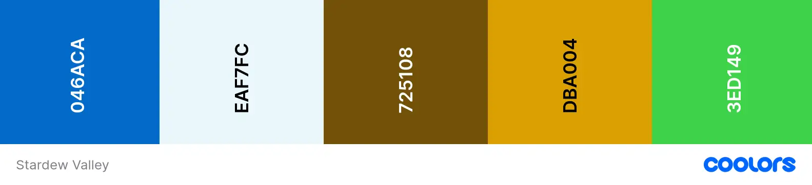

# Stardew Valley Themed Memory Game


#### **By Zoe Heathcote**
[Click here to view the live web application](https://zog08.github.io/memory-game-MP2/)

This is the documentation for my web application: Stardew Valley Themed Memory Game. It has been built using HTML5, CSS3 & JavaScript for educational purposes as part of Code Institute’s Diploma in Web Application Development Course.

- - -
## Table of Contents

1. [Project Development & Planning](#project-development--planning)
    * [Project Goals](#project-goals)
    * [Research](#research)
    * [User Stories](#user-stories)
    * [Content](#content)
    * [Design, Layout & Structure](#design-layout--structure)
2. [Technologies Used](#technologies-used)
3. [Features](#features)
4. [JavaScript Functionality](#javascript-functionality)
5. [Testing & Bugs](#testing--bugs)
6. [Deployment](#deployment)
7. [Credits](#credits)

- - -
## Project Development & Planning
Throughout the development of this game I followed the principles of User Experience (UX), including the 5 planes of Strategy, Scope, Structure, Skeleton & Surface. At all times I wanted to make sure that the website was easy to use, responsive, accessible and intuitive as well as meeting the goals and needs of the user and client.
- - -
### Project Goals

#### **Project Purpose**
A web-based game that tests the users memory and invokes a theme of the popular existing game, Stardew Valley.

#### **Client Goals**
The quiz was built as the second milestone project for my Diploma in Web Application Development with [Code Institute](https://codeinstitute.net/) as a learning tool for interactive frontend development and my first project using JavaScript and so didn't have a specific client.
However in order to make the end product more professional and to help with create a clear scope for the project I treated it as a real-world application which could be used by a person wishing to play a game or as a fan of Stardew Valley. This client's goals would be:

* Engaging users with a fun game to test their memory
* Engaging users who are fans of Stardew Valley 
* Engaging users who have not yet heard of Stardew Valley and give them a taste of its themes and artwork, and maybe get them hooked.
* Passing time or giving the client extra activities for their site in the theme of gaming or Stardew valley

#### **User Goals**
The audience for this game would be people of any age who has either an interest in testing their memory in a fun way, or users who are or would like to become a fan of Stardew Valley. The game does not depend on any prior knowledge of Stardew Valley though, so anyone could use it.
User Goals:
* To test their own memory skills and try to improve their score
* Have some fun playing a game
* Ability to engage where little or no prior Stardew Valley knowledge is required to play
* To learn more about the artwork and characters from Stardew Valley and pique their interest.

- - -
### Research

#### **Market Review**
I looked at a variety of online memory games, some from past Code Institute students and some found elsewhere on the internet. You can see some of the pages researched below:

[Helpful Games Memory Game](https://www.helpfulgames.com/subjects/brain-training/memory.html) | [Improve Memory Card Game](https://www.improvememory.org/brain-games/memory-games/magic-cards/) | [Nintendo Characters Merry Matches Game](https://play.nintendo.com/activities/memory-match/holiday-merry-memory-match-game/) | [Disney Characters Wordwall Memory Game](https://wordwall.net/resource/3421059/princess-memory-game) | [Musical Instrument Memory Game](https://insidetheorchestra.org/outside-the-orchestra/musical-memory/) 

#### **Key Takeaways from Market Review**
* Where I am only providing a single level of difficulty, it helps to play against a clock to imrove yourself
* It was less enjoyable when the cards were not easily discernable from each other
* Some quizzes used noises, music, and animations which did not improve the game but did add fun to the experience
* Some quizzes were slow to turn the cards and this affected my enjoyability
* Some websites were far too busy, with adverts and unusual placements taking away from the ability to play the game

- - -
### User Stories
Based on the research and goal development above I created a list of user stories. I felt that the game was most likely to be something that a visitor came across once and perhaps played a few times in a row, rather than repeatedly, as it would likely form part of a bigger website e.g. a Stardew Valley or gaming fan site, with a user moving on to discover more about the products offered, so all user stories relate to a first time user.

#### **User**
1. I want to take part in a fun, online game
2. I want to test my memory skills
3. I want to improve my memory skills / brainpower / speed
4. I want to enjoy the Stardew Valley theme
5. I want to access the quiz on any device
6. I want to navigate the site easily

#### **Client**
7. I want to entertain visitors to my site and keep them there for longer periods of time
8. I want to educate the user on Stardew Valley Characters and artwork
9. I want the user to enjoy visiting my site
10. I want to capture new audiences and translate them into regular visitors
11. I want the site to work correctly and efficiently

- - -
### Content
The game is made up of 6 pairs of character cards made popular by the original game Stardew Valley. 
These characters are:
* Emily
* Abigail
* Caroline
* Krobus
* Cat
* Dog 

The artwork in the background, fonts and images are all taken from the official Stardew Valley game to show a cohesive branding.

#### **Overview of page content
* When the game is started, the cards are shuffled face down.
* The user clicks pairs of cards to find a matching pair.
* If a matching pair is found the cards remain turned, if there is no match the cards are returned to face down.
* There is a timer that starts when the user makes their first card choice.
* You win the game by finding all the matches.
* The amount of moves (cards turned over) is stored and if the users score is in the top five fewest moves, their name is added to the High Scores list.

- - -
### Design, Layout & Structure

#### **Wireframes**
I decided to create a fully designed site in Balsamiq, developing the structure, skeleton and layout as well as the style and look of the site, making all major creative design decisions, including the colours, fonts & layout prior to beginning coding. I created a site that was very similar over mobile, tablet and desktop and made sure that responsiveness was at the forefront of the application from the beginning.

<details><summary>Start Page</summary>


</details>

<details><summary>Start Page, How To Play</summary>


</details>

<details><summary>Start Page, Click To Play</summary>


</details>

<details><summary>Game Page</summary>


</details>

<details><summary>End Page</summary>


</details>

<details><summary>404 Page</summary>


</details>
   
- - -
#### **Structure**

The structure of the site is informed by the scope, user and business goals as well as the principles of IXD (interaction design) to make sure I was conforming to users' expectations and making everything as intuitive as I could.

The site has a simple structure, there are in total, 3 pages plus the 404 page. The game is contained on one page. The HTML is kep to a minimum where possible, and javascript introduces this via functions as the game is played.

* Start Page - a brief intro with a drop down menu to read the rules of the game, and a button to click to play the game.
* Game Page - the main game play area, with a moves counter and timer, and an option to click back to the start screen via the main logo
* End Page - the results of the game, with total moves shown and a form with input to save your name to a hi-score list. There is also buttons to direct straight back to the game to play again, or a button to go back to the main start page.

There is also a 404 page for when a user lands on a non-existent page with a button to link back to index.html to start the game again

All pages have a clickable logo header at the top of the screen to redirect back to the start page for consistency.

- - -
#### **Colour & Design**

The design of the site is influenced by the original Stardew Valley game (https://www.stardewvalley.net/), using elements of the original game design such as the background photo, fonts and images of the characters. I have therefore used shades that match the original design and branding of Stardew Valley. I have ensured that the fonts chosen are compatible with accessibility in terms of size, colours and legibility.
I colour picked using coolors.co using a Stardew Valley theme screenshot, then altered these codes to find a final, well contrasted, colour palette considering the by nature very busy design of the graphics.

<details><summary>Initial Colour Picker from Screenshot</summary>

</details>

<details><summary>Initial Colour Palette</summary>

</details>

<details><summary>Adjusted Final Colour Palette</summary>

</details>


- - -
**Other Design Choices**
* The use of shadows on boxes and fonts to ensure legibility and to make them pop in the very 2d nature of the design.
* Consistent use of border on boxes, input, cards in brown to lift the elements from the busy background while keeping in theme
* The use of a themed cursor, a 'Junimo' that looks like a little apple character when hovering over the cards on desktop

- - -
#### **Fonts**

I downloaded the specialty font as a .woff file straight into the documents. The font from Stardew Valley was not available on Google Fonts or similar, therefore this was the only way it could be done. It was found on reddit made by user @cowsplay and downloaded from [their dropbox](https://www.dropbox.com/scl/fo/yj7f693fastcxousb4a77/ALOsUplSqL1DSpqk6iJ9sK0?rlkey=jt2mobz467ah9vhcyf404244e&e=1&st=zss04ys1&dl=0)
I had a fallback font of sans-serif standard font as I felt this was a good match with the 8-bit simplified nature of the design. 

- - -
## Technologies Used

### Languages
* [HTML](https://en.wikipedia.org/wiki/HTML5)
* [CSS](https://en.wikipedia.org/wiki/Cascading_Style_Sheets)
* [JavaScript](https://en.wikipedia.org/wiki/JavaScript)

- - -
### Tools

* [Git](https://git-scm.com/)
    * Used for version control via GitPod by using the terminal to Git and Push to GitHub
* [GitHub](https://github.com/)
    * Used to store the project code after being created in GitPod / Git
* [Gitpod](https://www.gitpod.io/)
    * Used to create, edit & preview the project's code
* [Balsamiq](https://www.balsamiq.com/)
    * Used to develop the wireframes in to a full mockup including colours, fonts, proportions etc
* [Reddit for Stardew Font](https://www.reddit.com/r/StardewValley/comments/4dtgp7/by_popular_request_a_stardew_valley_font_for_your/) Reddit user @cowsplay had built a custom font for use with attribution.
    * Used to select & import the font to the project (Stardew Valley Font)
* [Stardew Valley Web Site](https://stardewvalley.net/)
    * Provided by ConcernedApe, the official Stardew Valley page. Used for design research and themes.
* [Stardew Valley Wiki](https://stardewvalleywiki.com/)
    * Open source wiki page for Stardew Valley fans. Used for design research and to download all character cards, custom cursor, favicon, colour palette, images and background image
* [Coolors](https://www.coolors.co)
    * Used to help create the colour pallette with their picker tool, and adjust to find final colour palette
* [Cloudinary](https://cloudinary.com/tools/png-to-webp)
    * Used to change images to webp format
* [Tiny PNG](https://tinypng.com/)
    * Used to further optimise the images for the site and reduce file size
* [Techsini Mockup](https://techsini.com/multi-mockup/)
    * Creating the mockup images for the README
* [Google Chrome](https://google.com/chrome)
    * Used for web browser as default, development tools and also for testing via Lighthouse service.
* [WAVE](https://https://wave.webaim.org/)
    * WAVE accessibility reports during testing
* [JSHint](https://jshint.com)
    * JS Hint was used during testing to verify and spot errors in my javascrip code
* [W3C HTML Validator service](https://https://validator.w3.org/)
    * Used during testing to validate HTML code to help spot any errors or warning etc
* [W3C CSS Validation Service](https://jigsaw.w3.org/css-validator/)
    * Used during testing to validate HTML code to help spot any errors or warning etc
* [Stack Overflow](https://stackoverflow.com)
    * Used during build for help and advice, as documented in notes
* [Youtube](https://youtube.com)
    * Channels used to help with specific functions and styling,  @cognivisAI 
* [Udemy] (https://udemy.com)
    * Help and tutoring, courses from Laurence Svekis and Colt Steele
* [Code Institute](https://codeinstitute.com)
    * Initial training, support, mentoring and tutoring
- - -
## Features

### All Sections/Pages

#### **Favicon**

<details><summary>Screenshots</summary>

* **Tab icon for Chrome browsers**


* **Tab icon for Safari browsers**


*Favicon*

</details>

* I included a Favicon for the site using the 'Junimo' image from Stardew Valley. This helped to build the brand and continue the site design in the user's browser tab. It is also the same as the custom cursor hover over the playing cards.
* **User stories covered: 4, 6, 8, 9, 11**

#### **Logo**

<details><summary>Screenshots</summary>


*Logo*

</details>

* A simple logo with the name of the game
* The logo appears on all pages
* The logo is clickable. The 404 page had an alert on WAVE accessibility because of this, because it is a neighbour to the same link destination, namely the 'Go Home' button. I decided to ignore this warning as the 404 page is seldom visited and doesn't affect enjoyment of the game, and because I think it would be confusing to get back to the index page without the link in the logo if it broke from the way the logo worked on all other pages.
* **User stories covered: 4, 6, 7, 8, 9, 11**

- - -

### Index Page - Welcome


<details><summary>Screenshots</summary>


*Welcome page initial menu*


*Welcome page - 'How To Play' accordion*


*Welcome page - 'Click To Play' button accordion*

</details>

* Recognisable design and interface with Stardew Valley Theme
* Easy to find and use accordions with rules and play within each one.
* When one accordion is in use, the other collapses back
* Click to Play button - launches the memory game
    * Click to Play button has a hover effect on non touchscreen devices with a shadow transition appearing
* **User stories covered: 1, 4, 5, 6, 8, 9, 11**

- - -

### Game Section


<details><summary>Screenshots</summary>


*Game page at load*


*Game page in play*

</details>

* The game section is centred in the screen on all devices in order to keep the simplistic design at the core of the page
* The cards are sorted in 3 columns with 4 rows of cards in each
* The cards are shuffled on page load
* There is a moves counter about the game area that counts amount of times a card is turned over
* There is a timer that starts on the first card click
* Custom cursor of 'Junimo' image when hovering over the cards on desktop. This reflects the icon on the browser tab.
* When clicked, the cards have an 2 animations: they shrink back slightly, before visually turning 180 degrees
* You can click the logo header to return back to the main screen. This is well out of the way so the user is unlikely to accidentally click this mid-game.
* **User stories covered: All, 1-11**


### **End Results Page**


<details><summary>Screenshots</summary>


*End Results Page, after playing, upon load*


*End Page form with name typed in*


</details>

* As soon as the game is won, the user is directed to the end page automatically
* The most recent score is saved to local storage
* The most recent score is shown at the top of the form box
* The user can enter their name in the form and press the Save button
* If the score is in the top 5 scores (decided and sorted by fewest moves), the players entered name and score is shown on the hiScore list
* There are 2 more buttons at the base of the form box; one to play the game again (Play Again) and one for returning back to the index welcome page (Go Home)
* All the buttons have a hover animation; when the mouse is hovered over the buttons they transition with a shadow to give a 3d layered effect
* **User stories covered: 4, 5, 6, 7, 8, 9, 10, 11**

- - -
### 404 Page


<details><summary>Screenshots</summary>


*404 Page*

</details>

* 404 page to smoothly handle user's who have ended up on a non-existent part of the site
* This bespoke 404 page provides a positive emotional response to the user and a better user experience
* The page has the same design as the rest of the site, so the users don't feel like they have left the site, encouraging them to return to the home page
* The text is light hearted and relevant to the theme of the quiz
* There is a button to take the user back to the home page so there is no need to user the browser back button
* The logo also has a link to return to the home page, as is consistent with the rest of the website on all pages
* **User stories covered: 5, 6, 8, 9, 11**

- - -
### Future Features
I would like to expand the site in the future with the following features

#### **A way to lose the game**
Give the user the ability to lose when playing the game. Suggestions would be for time to run out, or to complete in an allocated amount of moves.

#### **Multiple levels**
Give the user the ability to choose a level with amount of cards chosen at start. Or the levels to get progressively harder as you complete each level

#### **Change the cards on each game**
Have the cards within the game board to be chosen from a pool of cards so that you get a different choice of pairs each time

#### **Global scoreboard**
Have the ability to save the hiscores to a global hiscore board rather than just local storage

#### **A scoreboard with timer**
Take the time taken into account and display. Where the Moves score is the same, sort the scores by lowest time

- - -

## JavaScript Functionality

This section explains in plain English what happens in the JavaScript code as the user moves through the game. This is in addition to the comments in the JavaScript Code.

### Welcome Page Section

<details><summary>Details</summary>

* The user is faced with a welcome page, including logo and graphics that are instantly recognisable
* The two accordion sections stay active until the other accordion is clicked and brought to focus
    * If the user would like to read the rules, click the button reading 'How to Play'
        * A drop down accordion box appears with the text of the rules.
    * If the user would like to play, click the button reading 'Play Game'
        * The button directs the user to the Game page
    
    ```
    accordion.forEach(function (ele) {              
        ele.addEventListener('click', toggleEle);
    });

    function toggleEle(e) {
        accordion.forEach(function(ele) {
            ele.classList.remove('active');
        });
        this.classList.toggle('active');
    }
    ``` 
        
</details>

### Game Page Section

<details><summary>Details</summary>

* When the page loads, the cards within the html code are shuffled in the 12 place grid system:

    ```
    function shuffle() {                   
    cards.forEach(card => {
        let randomPos = Math.floor(Math.random() * 12);
        card.style.order = randomPos;
    }
    ```

* When the user clicks the first card,
    * The first card is flipped
    * The timer is started
    * The move counter increases by 1 (and with every subsequent time an unflipped card is clicked)
* If the first card is clicked twice, nothing happens, a function is invoked to stop that first card being considered as the second click
* The class of 'flip' is added to the first flipped card and the move increases by 1
* when the second new card has been flipped, it is checked for a match

    ```
    function startTimer () {
        interval = setInterval(() => {
            time.innerHTML = minutes + "mins " + seconds + "secs";
            seconds++;
            if (seconds == 60) {
                minutes++;
                seconds = 0;
            }
        }, 1000);
    }
    
    function flipCard() {
        if (lockBoard) return;
        if (this === firstCard) return;     
        this.classList.add('flip'); 
        moveCounter();

    if (!hasFlippedCard) {
        hasFlippedCard = true;
        firstCard = this;
        return;
    }
        secondCard = this;
        checkForMatch();
    }

    function moveCounter() { 
        moves++;
        counter.innerHTML = moves;
        if (moves == 1) {
        startTimer();
        }
    }

    ```

* The function checkForMatch checks to see if the cards flipped match each other
    * If the cards match, the cards stay flipped to bottom face up and they are disabled on the board
    * If the cards don't match, the class of list is removed from the chosen cards and the cards are reset to face down
    * The non-matching cards are shown for 1.5 seconds before they return to face down and reset

    ```
    function checkForMatch() {
    let isMatch = firstCard.dataset.pic === secondCard.dataset.pic; 
       isMatch ? disableCards() : unflipCards();      
    }

    function disableCards() {
        firstCard.removeEventListener('click', flipCard);
        secondCard.removeEventListener('click', flipCard);
        pairs++;
        if (pairs == 6) endGame();
        resetBoard();
    }

    function unflipCards() {
        lockBoard = true;
        setTimeout(() => {
            firstCard.classList.remove('flip');
            secondCard.classList.remove('flip');
            resetBoard();
        }, 1500);
    }
    ```

* If all the pairs have been found, (6 pairs), then endGame function is invoked
    * The game is ended
    * The most recent score is saved to local storage
    * After less than a second (to allow for showing the last pair reveal), the user is redirected to the End page

```
    function endGame() {
        setTimeout(()=> {
            stopTimer();
            localStorage.setItem('mostRecentScore', moves);
            redirect();
        }, 300);
}
```

</details>

### End Hiscores Page Section

<details><summary>Details</summary>

* When the user is redirected to the End page, they are faced with a rewritten text box with the hiscore, retrieved from local storage
    * If the user does not type anything in the test box, the save name button is disabled

    ```
        finalScore.innerText = mostRecentScore;
        username.addEventListener("keyup", () => {
            saveScoreBtn.disabled = !username.value; 
        });
    ```

* Only when the name is entered and Save button is pressed by the user, the high score and name is saved to the local storage
* The users most recent score is pushed to the high score array stored.
* The array of previous stored scores are sorted ascending, low to high
* The top 5 highest scores are taken
* The new list of top 5 scores are saved to local storage
* The scores are converted into a string
* When the save button is clicked, the page is reloaded and shows the new list or hiscores on the page in a list

    ```
        saveHighScore = e => {              
            e.preventDefault();

        const score = {
            name: username.value,
            score: mostRecentScore
        };

        highScores.push(score);
        highScores.sort( (a,b) => a.score - b.score);      
        highScores.splice(5);                               
        localStorage.setItem("highScores", JSON.stringify(highScores)); 
        window.location.reload();
            };

highScoresList.innerHTML = highScores               
        .map(score => {
            return `<li class="high-score">${score.name} - ${score.score}</li>`;
        })
    .join("");


* After the game has ended, the user can decide whether:
    * To play again by pressing 'Play Again' button
    * Go back to the Welcome page by pressing 'Go Home' button


</details>

### 404 Page Section

<details><summary>Details</summary>

* If the user somehow clicks on a link that is broken etc they will end up on the themed 404 page
* The text shows that something has gone wrong with an 'Oops' message
* The same buttons appear to direct the user back to the home Welcome page

</details>

- - -
## Testing & Bugs
[See TESTING.md for full breakdown of testing & bugs](TESTING.md)

- - -
## Deployment

### GitHub Pages

The site was deployed to GitHub pages. The steps to deploy are as follows: 
1. In the GitHub repository, navigate to the Settings tab 
2. From the left hand menu select 'Pages'
3. From the source select Branch: main
4. Click 'Save'
5. A live link will be displayed when published successfully. 

The live link can be found here - [https://https://zog08.github.io/memory-game-MP2/](https://https://zog08.github.io/memory-game-MP2/)

### Forking the GitHub Repository

You can fork the repository by following these steps:
1. Go to the GitHub repository
1. Click on Fork button in upper right hand corner

### Cloning the GitHub Repository

You can clone the repository to use locally by following these steps:
1. Navigate to the GitHub Repository you want to clone
2. Click on the code drop down button
3. Click on HTTPS
4. Copy the repository link to the clipboard
5. Open your IDE of choice (git must be installed for the next steps)
6. Type git clone copied-git-url into the IDE terminal

The project will now be cloned locally for you to use.

- - -
## Credits

### Code

* Small code snippets & methods taken from online searches. All relevant code is credited in JavaScript files.
    * [Laurence Svekis, Udemy](https://www.udemy.com/share/101XdM/): Tutorial on creating JS accordions helped with this code
    * [CogniVis AI youtube channel](https://youtu.be/-5V0rUxJUbY?feature=shared): Tutorial for learning base of timer and moves counter
* Larger, more general tutorials for required code:
    * [CodeSketchLab youtube playlist](https://youtu.be/eMhiMsEC9Uk?si=vu4F7Uf1qoIUBhz6): Memory game tutorial, helped with datasets, grid layout and shuffle, general tips for memory game success
    * [DCode on Youtube](https://youtu.be/bznJPt4t_4s?si=9jmvQqTX3g11ed5F): Memory game tutorial, learning for datasets and general memory game tips and ideas


- - -
### Media

* Background Image [Stardew Valley by Concerned Ape on Pinterest](https://i.pinimg.com/originals/95/26/f0/9526f08c1e26dcb4f6b9afd9d76af8ab.png)

* Logo Image [Stardew Valley by Concerned Ape on Official Stardew Valley webpage](https://www.stardewvalley.net/)

* Character Images [Stardew Valley by Concerned Ape on Stardew Valley wiki page](https://stardewvalleywiki.com/Villagers)

* Back of Card Image [Stardew Valley by Concerned Ape on Stardew Valley wiki page](https://stardewvalleywiki.com/mediawiki/images/7/72/Achievement_Local_Legend.jpg)

* Favicon, 404, cursor Images [Stardew Valley by Concerned Ape on Stardew Valley wiki page](https://stardewvalleywiki.com/Stardew_Valley_Wiki)


### **Font**

* Stardew Font [Custom font by Redditor @Cowsplay](https://www.reddit.com/r/StardewValley/comments/4dtgp7/by_popular_request_a_stardew_valley_font_for_your/), [Dropbox file from @Cowsplay](https://www.dropbox.com/scl/fo/yj7f693fastcxousb4a77/ALOsUplSqL1DSpqk6iJ9sK0?rlkey=jt2mobz467ah9vhcyf404244e&e=1&st=zss04ys1&dl=0)


- - -
### Acknowledgements

* Especially to my new college lecturer, Tom Cowen, for picking up the pieces and being the best motivational speaker and time warden.
* My fellow CI cohort for advice and support
* My mentor Mo Shami for all his help and advice throughout the project
* The whole team at [Code Institute](https://codeinstitute.net/) for their teaching and support
* To [Concerned Ape](Stardewvalley.net) for making such an awesome game to begin with, and acting as inspiration for my project
* Friends and family for testing and for endless cups of tea while enduring hours of tapping noisily at my keyboard

- - -


x set up the page with background.
x upload font
x upload images for cards

x set up initial div for the cards
x add cards to the page in html
x style cards in css
x make cards flip when clicked
x show back of card when flipped
x check if cards match
x shuffle the cards
x increase the moves counter
x start timer at game begin, not on page load
x end timer at game
x check for end game - won - alert = "You won!"
add first page with rules and start game buttons
add extra level?


-added more cards, started with 9, realised it wasnt an even number!!
-redo of cards. Had put in 12 individual cards to the array, no matching cards!
-when clicking a non matched card, there was no visible turn for the second card. added timeout to fix visibility. flip class  
  removed instantly
-the board enabled multiple cards to be flipped in one go if you moved quick enough. (lockboard function Code Sketch youtube video 9 of 11)
- double clicking on a card made the game think it was doing its second click on the already revealed card.
- when revealing last card for final match the alert shows before last card is flipped. added timeout to allow time to view last card
- forgot to stop timer at end of game.
- logo image not displaying on deployed site, fixed src address to rectify


live testing done by my 9 year old daughter. She said "its fun!"
live testing during development by 11 year old daughter. A nod of approval was a big win for me, i felt 100x aura added.
live testing done by my husband. He is not familiar with Stardew Valley but he thought it was cutesy.
