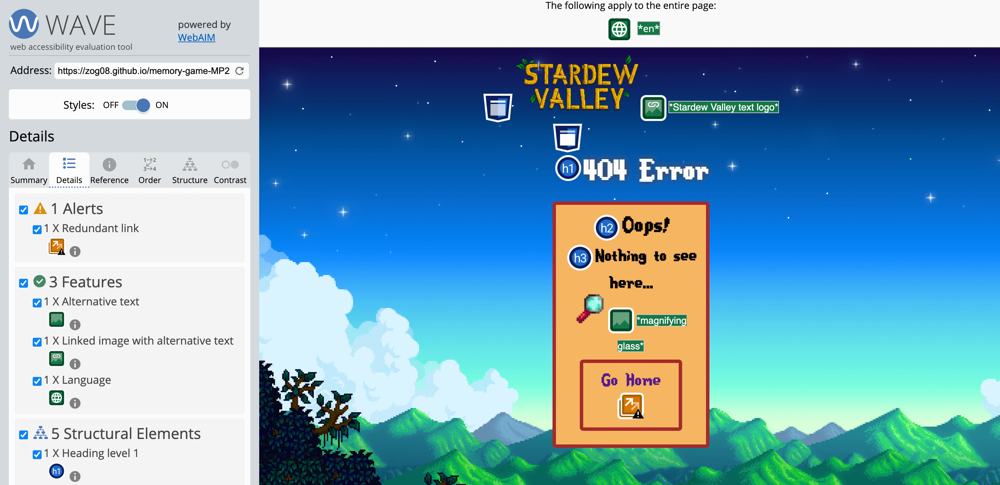

# Stardew Valley Themed Memory Game - Testing

**By Zoe Heathcote**


[Click here to view the live web application](https://zog08.github.io/memory-game-MP2)

This is the testing documentation for my web application: Stardew Valley Memory Game.

[Full README available here](README.md)

## Table of Contents

1. [Introduction](#introduction)
2. [Automated Checks and Validation](#automated-checks-and-validation)
    * [HTML Validation](#html-validation)
    * [CSS Validation](#css-validation)
    * [JavaScript Validation](#javascript-validation)
    * [Accessibility](#accessibility)
    * [Performance](#performance)
3. [Manual Testing](#manual-testing)
    * [Testing User Stories](#testing-user-stories)
    * [Feature Testing](#feature-testing)
        * [Responsiveness / Device Testing](#responsiveness--device-testing)
        * [Browser Compatibility](#browser-compatibility)
        * [Feature Testing Results Table](#feature-testing-results-table)
4. [Bugs & Fixes](#bugs--fixes)
    * [Known & Remaining Bugs](#known--remaining-bugs)

- - -

## Introduction

While building my memory game site I developed a comprehensive testing plan to ensure all elements were functioning correctly, using predominantly manual testing. I did try some automated tests during and at the end of the development process, which was a great learning process as part of my Code Institute learning journey. I felt that due to the low complexity of the website and high complexxity of the automated testing that I would need to write that this wouldnt be necessary for my application, with it beng fairly simple in content, and that it would be better served with in-depth manual testing which is detailed below.

My manual testing involved going through the game and manually checking all elements behaved as expected and making sure that the JavaScript was producing the correct results based on the user selections. I have also included details of automated testing/validation that I undertook which included validation for HTML & CSS and checking the site for accessibilty and performance. The site was tested throughout the process, both in the development and deployed version of the sites. All the test results detailed below are based on the [deployed site](https://zog08.github.io/memory-game-MP2).

## Automated Checks and Validation

### HTML Validation

I ran the code for all the pages through the [W3C HTML Validator](https://validator.w3.org/nu/).

#### **HTML Errors**

There were 2 errors, some occurring on the same element across multiple pages:

<summary>Error 1</summary>

* I had closed my image tags with a trailing /> which isnt relevant to coding today.
* Fix: remove the trailing /> and replace with > on all image tags.

<summary>Error 2</summary>

* I had neglected to add the logo image / link into a header section (this also threw up errors in my WAVE report)
* Fix: Add header section above body HTML with the logo inside.

#### **HTML Validation Post-Fix**

<details><summary>HTML Validation Final Results - index.html</summary>


</details>

<details><summary>HTML Validation Final Results - game.html</summary>


</details>

<details><summary>HTML Validation Final Results - end.html</summary>


</details>

<details><summary>HTML Validation Final Results - 404.html</summary>


</details>

- - -

### CSS Validation

I ran the CSS code through the [W3C CSS Validator](https://jigsaw.w3.org/css-validator/#validate_by_input).

#### **CSS Errors**

<summary>CSS Validation Initial Results</summary>

There were no errors, but 1 warning:

Warning 1: -webkit-transition-duration is a vendor extension

* Fix: No fix, these vendor extensions help support browser compatibility and are proprietary code that the validator cannot assess properly.

- - -

### JavaScript Validation

I ran the JavaScript code through [JSHint](https://jshint.com/).

There were no errors but there were a number of warnings which can be grouped as follows:

<details><summary>Pre-Fix JS Warnings / Comments</summary>


</details>

<summary>Warning 1: Missing semi-colons</summary>

* Fix: add semi-colons as appropriate

<summary>Warning 2: "Expected an assignment or function call and instead saw an expression"</summary>

* Fix: No fix. This is correct code, as an on-click event found in HTML.

I did extensive investigation about these warnings, it seems to relate to the way I've written the function.

<summary>Warning 3: Undefined Variables</summary>

* Fix: These variables are referred to outside .js file (as onclick events within html etc) and therefore arent picked up by the input method of css checker

#### **JavaScript Validation Post-Fix**

<details><summary>JavaScript Validation Final Results</summary>


</details>

[Go to Top](#stardew-valley-themed-memory-game---testing)

- - -

### Accessibility

I ran the site through the [Wave Web Accessibility Evaulation Tool](https://wave.webaim.org/).

#### **Accessibility Errors**

On index, game and end .html there were 2 warnings, the same occuring across the pages:

<details><summary>Warnings and screenshot</summary>


</details>

##### Alert 1: Missing structural element

* Missing Header section
* Fix: Added Header section within html, with logo image and link within

##### Alert 2: Contrast error

* Low contrast on h1 across all pages
* Fix: I had not set a fallback background colour in case the background image fails to load. Set background colour for body. Also checked manually that the image and h1 text had sufficient contrast (7.92:1, passes)

<details><summary>Post-fix 404 page and screenshots</summary>




</details>

##### Alert 3: No fix made

* Redundant link
* I decided not to change the content of this 404 page. The test showed that there were two links next to each other that were the same. This was the 'Go Home' button beneath the 404 message, and also the link within the the page header logo. I decided that for the sake of continuity across the pages that I shouldn't remove the link from the top logo. I decided that I should keep the button to instruct the player to return to the index page as without it the page would be very confusing to navigate away from. These reasons, coupled with the hope that the 404 page wouldn't be needed very often and did not form part of the normal day-to-day usage of the page, I have concluded to ignore the warning on this page only.

#### **Wave Web Accessibility Results Post-Fix**

<details><summary>Wave Web Accessibility Final Results - index.html</summary>


</details>

<details><summary>Wave Web Accessibility Final Results - game.html</summary>


</details>

<details><summary>Wave Web Accessibility Final Results - end.html</summary>


</details>

#### **Additional Accessibility Checks - Placeholder Text & Images**

When tidying up the project in the final stages before submission I did some general house keeping and testing to ensure that everything looked easily readable to my own knowledge. I manually tested with the cherry picker tool on WAVE where a font appeared above my background image. I also ensured that all alt texts were sensibly named and didnt contain any uneeded or confusing information. I ensured that my form inputs were properly labelled.

- - -

### Performance

I ran the site through Google Chrome Dev Tools' Lighthouse to check on its performance on both mobile and desktop devices, where the scores and comments were identical for both devices tested.
I found that my website scored excellently in all areas tested, but I decided to look into some of the smaller warnings that were flagging to see improvements could be made in the timeframe given.

#### **Results**

<details><summary>All Pages - console warning</summary>

* 'Best Practise' flagged an error in console, "Browser errors were logged to the console" "Cannot set properties of null"
* Decision made to not change the code to improve this score. The error is logged because before the game is played there is no score to save / get from local storage hence the null output. This error does not show when tested after a game is played and the mostRecentScore is ready in local storage to be retrieved by the function that sets the innerText.


</details>

<details><summary>Console Error Test Rerun</summary>

* Lighthouse test re-run after playing game where there is a mostRecentScore stored locally and ready to get.


</details>

<details><summary>Other Pages Results</summary>

##### **Game Page**


##### **End Page**


##### **404 Page**

This page had a warning for 'Low resolution image used'. I decided not to change the image because there was no other image of the Stardew specific magnifying glass available in greater resolution. I decided that because the image is small and by its very nature supposed to look lo-fi and pixelated that it did not affect enjoyment of the game. The previously found console warning also showed here regarding local storage cannot set property of null, but if I retested with a mostRecentScore saved in the local storage, again this negated the error and thus improved the score.


</details>

[Go to Top](#stardew-valley-themed-memory-game---testing)

- - -

## Manual Testing

### Testing User Stories

I tested the site based on my user stories:

| No. | User Goal | How is it achieved? |
| :--- | :--- | :--- |
| 1 | I want to take part in a fun, online game | The memoy game is a fun, online game which gives people an insight in to the worl of Stardew Valley. It has been designed to be light-hearted and lo-fi in style to keep things fun. |
| 2 | I want to test my memory skills | The memory game uses 12 upturned character cards to test the users memory skills |
| 3 | I want to improve my memory skills / brainpower / speed | While playing multiple times, scores improve as the user can more confidently identify each character from Stardew Valley. The timer and move counter quantify improvement, and the leader board with top 5 scores incentivise the user to improve |
| 4 | I want to enjoy the Stardew Valley theme | The website has been based on the original Stardew Valley artwork, using the official characters, font and theme throughout. |
| 5 | I want to access the quiz on any device | The site has been designed to be as minimal and lo-fi as possible. Special consideration has been taken to ensure that the game appears on small to large screens without loss of enjoyment or accessibility. |
| 6| I want to navigate the site easily | Every page has a link to the welcome screen within the logo header. The buttons are noticeable as a usable feature. There is uncluttered and friendly design layout throughout the website. Buttons and forms are labelled correctly, along with aria-labels for screen readers. |
| 7 | I want to entertain visitors to my site and keep them there for longer periods of time | The game is designed as simple and easy to understand, yet grabs the users attention. The hiscore board motivates the user to try again to beat a previous score. |
| 8 | I want to educate the user on Stardew Valley Characters and artwork | All of the artwork was lifted from the [Official Concerned Ape, Stardew Valley game](stardewvalleywiki.com). The images throughout are of good quality and the design is cohesive in terms of branding etc. |
| 9 | I want the user to enjoy visiting my site | The site is fun to play and easy to use. As a user its a fun way to become aware of the Stardew Valley brand and the original game. |
| 10 | I want to capture new audiences and translate them into regular visitors | The user should find the game enjoyable and easy to use, therefore resulting in the user staying to play for longer and getting acquainted with some of the characters presented within. The branding and visual imagery goes a long way to presenting an overview of how the original game looks, thus whetting the users appetite and search for more things Stardew Valley. |
| 11 | I want the site to work correctly and efficiently | The site has been extensively tested by myself and other throughout the site build, and also through validation sites and accesibility tests etc. Corrections and debugging has been ongoing until a useable version of the site had been produced for use. Links and buttons, and the game itself has been manually tested by family and acquaintances. A simple UX has worked perfectly for this project. |

#### User Story 1: I want to take part in a fun, online game

| **Feature** | **Action** | **Expected Result** | **Actual Result** |
|-------------|------------|---------------------|-------------------|
| Memory Game | Click 'Play Game', click 'Click to Play', play the game by tapping / clicking on the card images to find matching pairs | Game is played | Works as expected |

<details><summary>User Story 1: Screenshots</summary>


**Screenshot of game in play**

</details>

#### User Story 2: I want to test my memory skills

| **Feature** | **Action** | **Expected Result** | **Actual Result** |
|-------------|------------|---------------------|-------------------|
| Memory Game | Click 'Play Game', click 'Click to Play', play the game by tapping / clicking on the card images to find matching pairs | Game is played | Works as expected |
| Hi-Score table | Click 'Play Game', click 'Click to Play', play the game by tapping / clicking on the card images to find matching pairs. Once game is over, enter username in form box, click Save Name button | Game is played, hiscore is stored locally. Name is saved. Top 5 scores displayed on screen | Works as expected |

<details><summary>User Story 2: Screenshots</summary>


**Game in play**


**Hiscore table offer qualitative visualisation of score**

</details>

#### User Story 3: I want to improve my memory skills / brainpower / speed

| **Feature** | **Action** | **Expected Result** | **Actual Result** |
|-------------|------------|---------------------|-------------------|
| Text box containing move counter and timer | Click 'Play Game', click 'Click to Play', play the game by tapping / clicking on the card images to find matching pairs. Timer move counter starts on first click and ends on game completion | Game is played, timer and moves counter shown correctly on screen. | Works as expected |
| Hi-Score table | Click 'Play Game', click 'Click to Play', play the game by tapping / clicking on the card images to find matching pairs. Once game is over, enter username in form box, click Save Name button | Game is played, hiscore is stored locally. Name is saved. Top 5 scores displayed on screen | Works as expected |
| Memory Game | Click 'Play Game', click 'Click to Play', play the game by tapping / clicking on the card images to find matching pairs | Game is played, knowledge of characters improve | Works as expected |

<details><summary>User Story 3: Screenshots</summary>


**Time and move counters offer incentive to improve / beat the clock**


**HiScore table offers incentive to improve and reach the leaderboard top**


**Playing the game improves knowledge of characters and use of memory**

</details>

#### User Story 4: I want to enjoy the Stardew Valley theme

| **Feature** | **Action** | **Expected Result** | **Actual Result** |
|-------------|------------|---------------------|-------------------|
| Logo header image from original Stardew Valley Game | Visible at the top of all the pages on the site. | Improves user knowledge and enjoyment of Stardew Valley branding and design. | Works as expected |
| Memory Game | Click 'Play Game', click 'Click to Play', play the game by tapping / clicking on the card images to find matching pairs | Game is played, knowledge of characters and branding design enjoyed | Works as expected |
| Stardew Valley official font | Visible on almost all text on the website. | On any given page of the site, knowledge andawareness of Stardew theme is enjoyed | Works as expected |

<details><summary>User Story 4: Screenshots</summary>


**Official Stardew Valley logo**


**Multiple official Stardew Valley characters and background image**


**Official Stardew Valley custom font**

</details>

#### User Story 5: I want to access the quiz on any device

| **Feature** | **Action** | **Expected Result** | **Actual Result** |
|-------------|------------|---------------------|-------------------|
| Played on Apple Macbook air 2024 13" | All pages tested, screenshots shown from responsive google chrome inspection panel | User can play on laptop / desktop screen. Also tested on the named device, and inspected with Safari Web Development Tools. | Works as expected |
| Played on Apple iPad mini | All pages tested, screenshots shown from responsive google chrome inspection panel | User can play on tablet sized screen, in both portrait and landscape mode. Also tested on the named device, and inspected with Safari Web Development Tools. | Works as expected |
| Played on Apple iPhone SE | All pages tested, screenshots shown from responsive google chrome inspection panel | User can play on smaller phone screen in portrait and landscape mode. Also tested on the named device, and inspected with Safari Web Development Tools. | Works as expected |

<details><summary>User Story 5: Screenshots</summary>


**Shown on Apple macbook Air 13" 2024**


**Shown on iPad mini in portrait mode**


**Shown on Apple iPhone SE in portrait mode**

</details>

#### User Story 6: I want to navigate the site easily

| **Feature** | **Action** | **Expected Result** | **Actual Result** |
|-------------|------------|---------------------|-------------------|
| Find correct open tab on browser | All pages tested, tab icon and title displayed on the tab. Click on tab to open the webpage where last left off. | User can easily find game on an opened tab | Works as expected |
| Stardew Valley logo with link to home page in | All pages tested, click on logo header to redirect to home welcome page | Return to home welcome page | Works as expected |
| Played on Apple iPhone SE | All pages tested, screenshots shown from responsive google chrome inspection panel | User can play on smaller phone screen in portrait and landscape mode | Works as expected |

<details><summary>User Story 6: Screenshots</summary>


**Junimo character tab icon / favicon to navigate to correct tab**


**All pages have back to home page link within the logo header image**


**Buttons are easily identifiable and accessible**


**Cards are laid out sensibly and large enough to observe correctly**


**404 page notifies of broken links etc and redirects you home without back button**

</details>

#### User Story 7: I want to entertain visitors to my site and keep them there for longer periods of time

| **Feature** | **Action** | **Expected Result** | **Actual Result** |
|-------------|------------|---------------------|-------------------|
| In game move counter and timer | Click to play game on home screen, play game on game screen and timer and moves counter start automatically | User can visually quantify how they are doing in the current game and figure out if they are improving. This incentivises the user to stay and play again. | Works as expected |
| Enter user name to save score | Once game has ended, user is automatically redirected to the end acreen. Click into the username form input. Enter name. Click save. | Name and most recent score is saved to the local storage. Incentivises user to stay and play again. | Works as expected |

| Hiscore list with player names and hiscores displayed |On end screen, after playing game and entering name to save as above, top 5 best score saved data is visually represnted on screen with player name and the corresponding score.  | The top 5 best scores and the corresponding player name is shown in the hiscore table on screen after page is refreshed. This incentivises the user to play again to beat a previous score. | Works as expected |

<details><summary>User Story 7: Screenshots</summary>


**Moves counter and timer incentivises the user to stay and beat the clock**


**Entering name incentivises the user to reach the hiscore board**


**Seeing the users name on the hiscore board incentivises them to stay and reach it**

</details>

#### User Story 8: I want to educate the user on Stardew Valley Characters and artwork

| **Feature** | **Action** | **Expected Result** | **Actual Result** |
|-------------|------------|---------------------|-------------------|
| Junimo character favicon | Visible at the top tab on an open desktop window | User can see the recognisable Junimo character on the open tab top on all pages, reminding them of the Stardew Valley characters and branding | Works as expected |
| Stardew Valley Logo | Present at the top header of all pages.  | Makes the branding cohesive and instantly recognisable as the official stardew valley branding. | Works as expected |
| Stardew Valley official font used in all text areas of the page (where supported) | All pages use the Stardew Valley font where supported.  | Makes the branding cohesive and instantly recognisable as the official stardew valley font. | Works as expected |
| Stardew Valley official characters and background images  | On all pages, the backdrop is instantly recognisable as Stardew Valley from the original game.  | The design features are followed by my page throughout to keep it cohesive, simple and recognisable | Works as expected |

<details><summary>User Story 8: Screenshots</summary>


</details>

#### User Story 9: I want the user to enjoy visiting my site

| **Feature** | **Action** | **Expected Result** | **Actual Result** |
|-------------|------------|---------------------|-------------------|
| Stardew Valley Logo | Visible on all pages as the top header | User can see the recognisable Stardew Valley branding and be excited about playing something in a theme they love. Links back to home page when clicked to make the site easier to navigate and more joyful to use. The colours and design really tap in to the fun Stardew Theme and is very visually appealing. | Works as expected |
| Rules to play | On index welcome page, click on 'How to Play' button.  | An accordion box unfolds on screen containing the rules to the game. Nice and simple. | Works as expected |
| Stardew Valley Memory card game | Navigate to game page by clicking on 'Play Game' then 'Click to Play'. From here you can tap or click on pais of cards to play a fun game.  | Fun game to test the users memory and make them familiar with Stardew Valley and some of its characters. Play is smooth and easy to use. | Works as expected |
| HiScore Board  | Once you have played the game as outlined in the previous action, the user is automatically redirected the the End page. Here the user can enter their name and if the most recent score makes the top 5 best, it is displayed as 'name' and 'score' on the hiscore board.  | The hiscore board appeases to the users enjoyment and incentivises them to stay and play again. | Works as expected |

<details><summary>User Story 9: Screenshots</summary>


</details>

#### User Story 10: I want to capture new audiences and translate them into regular visitors

| **Feature** | **Action** | **Expected Result** | **Actual Result** |
|-------------|------------|---------------------|-------------------|
| Use of Official artwork and characters | Visible on all screens and all pages | The user is introduced to the world of Stardew Valley by making them familiar with the cute design and artwork, and one hopes that the user becomes a fan of this style if theyve never seen it before. Or visits based on their past familiarity with Stardew Valley. | Works as expected |
| Enter user name to save score and hiscore board | Once game has ended, user is automatically redirected to the end acreen. Click into the username form input. Enter name. Click save. | Name and most recent score is saved to the local storage. Incentivises user to stay and play again, or revist again and again themselves to beat the last score. The user would hopefully share the game with friends to see if they could also beat their hiscore. | Works as expected |
| The memory card game | From welcome screen, click 'Play Game' and then 'Click to Play'. User can tap or click on the cards to match characters together, havoing fun while using their brain, and visually seeing whether theyre beating a previous score or time.  | The top 5 best scores and the corresponding player name is shown in the hiscore table on screen after page is refreshed. This incentivises the user to play again or revisit to beat a previous score. | Works as expected |

<details><summary>User Story 10: Screenshots</summary>


</details>

#### User Story 11: I want the site to work correctly and efficiently

| **Feature** | **Action** | **Expected Result** | **Actual Result** |
|-------------|------------|---------------------|-------------------|
| Multiple online tests taken out | The website has been put through rigorous online testing as outline in this document. To show Lighthouse testing, open the page on desktop Google Chrom. Right Click then choose 'Inspect'. Navigate to the Lighthouse menu in the top right corner and click 'Analyze page load'. Also used, JSHint, W3S CSS checker, W3S HTML checker, WAVE Accesibility reporting. | The user is subject to accessible and easy to use website, with good solid clean code at its core. The scores were all over the accepted levels. | Works as expected |
| Manual Testing | Throughtout development and at the end, manual testing was used by myself and those around me.  | Information and research from these tests were used to help generate an easier interface or smoother running game, and ensured no bugs or mistakes were shown in the final result | Works as expected |

[For screenshots and more details on testing through validators, please click here](#automated-checks-and-validation)

[For screenshots and more details on manual testing, please click here](#manual-testing)

- - -

### Feature Testing

#### **Browser Compatibility**

##### **Responsiveness / Device Testing**

The site was tested on the following devices

* Apple Macbook M3 Air 13", iOS Sonoma 14.5, 2024, Safari browser.
* Apple iPad Pro 12.9" 3rd Gen, iOS 17.6.1, portrait and landscape, Safari browser.
* Apple iPhone SE 1st Gen, portrait and landscape.
* Apple iPhone 14 pro, iOS 18.2.1, portrait and landscape, Safari, Chrome and MS Edge browsers.
* Samsung Galaxy s22+, portrait and landscape.
* Samsung Galaxy A35, portrait and landscape.
* Dell Optiplex 3050, Microsoft Edge browser, 23.5" screen.
* Google Chrome Developer Tools - simulator for all different device options as well as using the adjustable sizing options
* Safari Web Inspector Tools - simulator on safari specific browsers using adjustable sizing options

<details><summary>Testing various devices throughout the build: Image</summary>


**Testing on various devices at home throughout development**


**My children, the harshest critics, testing at home during development!**

</details>

##### **Peer-to-Peer Review**

The site was also submitted for review by my peers on Code Institute Slack Peer-to-Peer channel. I was given lots of support, moral and technical, with a coupke of future features suggested, and received with thanks!

**Bug found - specific to device testing:**

* Apple devices using Safari Logo header and meta div containing timer and move counter not centred on Safari browsers.
  * This was looked in to by using Safari Developer Tools on Macbook. Working in a similar way to Chrome developer tools, I was able to check and edit my code in the developer panel to figure out what was affecting the layout. Similarly, I was able to plug in my iphone to the mac and use developer tools directly from the phone safari broswer so I knew I was really getting to the root cause without using a simulator.
  * The fix was quite simple, it required me to add a margin or auto to the affected divs.

<details><summary>Safari Browser Bug: Screenshot</summary>


**Pre Fix Safari Bug**

</details>

<details><summary>Safari Browser Bug, Fixed: Screenshot</summary>


**Post Fix Safari Bug**

</details>

[Go to Top](#stardew-valley-themed-memory-game---testing)

- - -

### Feature Testing Results Table

#### **Every Page**

| Feature | Expected Outcome | Testing Performed | Result | Pass/Fail |
| --- | --- | --- | --- | --- |
| Whole Page | Layout is fully responsive | Checked all pages on various browsers and devices including Google Dev Tool and device simulators | All elements were fully responsive on all devices tested | Pass |
| All Page Contents | Background image, logo, buttons, inputs and game contents appear correctly and remain visible througout its use | Checked on various browsers and devices throughout game | All content appeared as expected | Pass |
| Favicon | Appears in browser tab | Checked browser tabs in different browsers and devices | Favicon appeared as expected | Pass |
| Header Logo | Links back to main welcome page when clicked | Clicked on logo header image | redierect happens as expected | Pass |
| Console | No errors appear in console throughout game | Checked console in dev tools during game play | Console logged one TypeErrors, relating to 'cannot set properties of null' [more information here](#performance) | Pass |

#### **Welcome Index Page Testing**

| Feature | Expected Outcome | Testing Performed | Result | Pass/Fail |
| --- | --- | --- | --- | --- |
| H1 Heading | Text appears in correct font, size and allignment | Loading page | Content appeared as expected | Pass |
| Accordion Sections | Loads with neither accordion in focus / both collapsed. Upon clicking that accordion is brought to focus and expanded correctly | Loading page / clicking on accordion | Load and work as expected | Pass |
| Rules section | Shows rules in correct font a properly spaced | Click on Rules section | Rules show as expected | Pass |
| Click to Play | Once the accordion reveals the click to play button and itself is pressed, redirect to Game page | Redirects to Game page on click | Button and link performs as expected | Pass |

#### **Game Area Page Testing**

| Feature | Expected Outcome | Testing Performed | Result | Pass/Fail |
| --- | --- | --- | --- | --- |
| H1 Heading | Text appears in correct font, size and allignment | Loading page | Content appeared as expected | Pass |
| Meta box containing timer and move counter | Text appears in correct size and allignment. On Load, box has no moves and no time displayed. Timer starts on first click, time ascending in seconds and minutes. Moves counter increments by one on every card chosen | Loading page | Content appeared as expected on load and during play | Pass |
| Game Div Contents | 12 game cards appear face down on load, in 3 columns and 4 rows | Page load | All content appeared as expected | Pass |
| Game Cards | Cards are shuffled. | When clicking the cards, each appears in a different order on each seperate game play | Cards appear shuffled each time | Pass |
| Game Cards | Animation on cards when clicked, size decrease on click and rotation by 180 degrees on turn | Clicking through and testing each card on different devices and browsers | The correct animations appear | Pass |
| Game Cards | When turned, character image revealed | Clicked on cards on multiple browsers and devices | Images appear as expected | Pass |
| Cursor Hover Effect | Custom cursor image, Junimo Character to match the tab icon | Hovered over all cards | Custom Cursor appears as expected | Pass |
| Game Cards | If a pair matches, the cards remain turned character face up and cannot be clicked again | Clicked on cards on multiple browsers and devices | Cards act as expected on match | Pass |
| Game Cards | If a pair does not match, only two cards can be overturned and they are returned to face down after the turn | Clicked on cards on multiple browsers and devices | Cards returned to face down. Cards cannot be clicked on multiple times, two seperate cards are shown | Pass |
| Game Area | All matches are found, redirect to End Page | Played game until all matches were found. Tested on multiple devices and browsers | Short delay at the end of game in order to let User see what the last matching cards were, before redirecting to end page. Most Recent Score saved to local storage | Pass |

#### **End Hi-Score Section Testing**

| Feature | Expected Outcome | Testing Performed | Result | Pass/Fail |
| --- | --- | --- | --- | --- |
| H1 Heading | Text appears in correct font, size and allignment | Loading page | Content appeared as expected | Pass |
| Form Box Contents | When game is complete, html is added to the Moves: section to show most recent score got from Local Storage | Complete game, redirect to end and on page load | All content appeared as expected  | Pass |
| Form Input Box | Appears on page load with 'username' as placeholder text. Can only click save if a key is clicked in the input box. Username saved to local storage | Game completed. Tried clicking save without a username, save button is disabled. Typed in username, save button is enabled  | Input box works as expected | Pass |
| Save Name button | Shadow animation on hover | Hover mouse over save button on various devices and browsers | Works as expected | Pass |
| Save Name button | Button disabled until keyboard input in username field | Tested on multiple devices and browsers | Button works as expected | Pass |
| Save Name button | On button click, the username and most recent score is pushed to the hiscore array. The array is sorted from low to high. The top 5 lowest scores are saved to the new array. The array is stringified and the page reloaded to show the new Hi Score list on screen | Tested on multiple devices and browsers | Button works as expected | Pass |
| Play Again button | Shadow animation on hover | Hover mouse over save button on various devices and browsers | Works as expected | Pass |
| Play Again button | When clicked, redirects the user to game page to play again | Button clicked on various devices and browsers | Works as expected | Pass |
| Go Home button | Shadow animation on hover | Hover mouse over save button on various devices and browsers | Works as expected | Pass |
| Go Home button | When clicked, redirects the user to index welcome page. | Button clicked on various devices and browsers | Works as expected | Pass |

#### **404 Page Testing**

| Feature | Expected Outcome | Testing Performed | Result | Pass/Fail |
| --- | --- | --- | --- | --- |
| 404 page contents | Heading, 404 message text, image and 'Go Home' button appear correctly | Load 404 page, check all content is correct | All content appears correctly | Pass |
| 404 page functionality | Typing in a non-existent URL will bring up 404 page | Typing in a non-existent url in browser | 404 page appears | Pass |
| Go Home Button | Hover effect with shadow animation on hover | Hovering over Go Home button | Button hover effect works correctly on multiple devices and browsers | Pass |
| Go Home Button | On clicking, redirects the user back to the home index welcome page | Clicking on Go Home button | Welcome index page loads  | Pass |

[Go to Top](#stardew-valley-themed-memory-game---testing)

- - -

## Bugs & Fixes

During development and testing, in addition to the improvements described in the validation section above, I encountered the following bugs:

- - -

### **1: Incorrect interface design**

At the start of development I built the game page with 3 rows and 3 columns, total of 9 cards. This looked excellent, very pleasing to the eye, symmetrical. But a very silly oversight on my behalf as that meant there was an odd number of playing cards and therefor couldnt be paired up.

- - -

### **2: Logo and Meta counter div not centered on any Safari browsers**

Having tested my website throughout using Google Chrome Inspection tools with no issues, I was surprised to find that near the end of development when I tested my site on Safari browser that the header logo on all pages, and the meta-div on the game page were not centred.
I realised that Chrome development tests for various sizes of devices but does not reproduce the browser used, in this case Safari.
I learned how to install developer tools for safari on my macbook and did some testing to figure out what Safari needed in order for the divs to be centred as shown on other browsers.
The missing code was quite simple, adding in auto margin to the divs, as follows, in the CSS code:

```CSS
.meta {
    .
    .
    margin: auto;
    .
    .
}

.logo {
    .
    .
    margin: auto;
    .
    .
}
```

<details><summary>Screenshots</summary>


**Before & After**

</details>

- - -

### **3: No names appearing on HiScore list on End Page**

All features worked up until the point of showing the name and scores after clicking save name button. The console was showing the correct array of usernames and scores, so everything else was working correctly.
I realised that the scores would only show if the user was redirected to another page. I didnt want to direct the player away from the last page yet, so I added a page reload to the js code as follows:

```javascript

saveHighScore = e => { 
    e.preventDefault();
const score = {
    name: username.value,
    score: mostRecentScore
};
highScores.push(score);
highScores.sort( (a,b) => a.score - b.score);
highScores.splice(5);
localStorage.setItem("highScores", JSON.stringify(highScores)); 
window.location.reload();               // reloads page when you click save, to show updated hiscore board
};

```

* Adding `window.location.reload();` to the saveHighScore function in javascript code

- - -

### **4: Null entered as hi-score**

If the user is directed by url to the end page, the user is able to enter their name and click save. This results in 'username' and 'score' being recorded as 'name' and 'null' because there is no mostRecentScore saved to the local storage to retrieve for array purposes.
The most sensible and least time consuming fix for this was to ensure that when the page is shared that the user is always given the index.html page.
Therefore no real fix was made, but I was no aware of the problem and could ensure that it wouldn't affect the game enjoyability

<details><summary>Screenshots</summary>


**Showing null as score**

</details>

### **5 More than two cards could be revealed in one turn**

If the user clicked the cards quick enough before they returned to face down, the user could reveal extra cards in one turn where only two should be shown.

Added lockboard function into javascript, where designated by comments in app.js file

- - -

### Known & Remaining Bugs

All information about remaining bugs is included in the information above.

1. [Null entered as high score](#4-null-entered-as-hi-score)
2. [Console error mentioned extensively in testing](#performance)

- - -

[Go to Top](#stardew-valley-themed-memory-game---testing)

[Go to TESTING.MD](TESTING.md)
